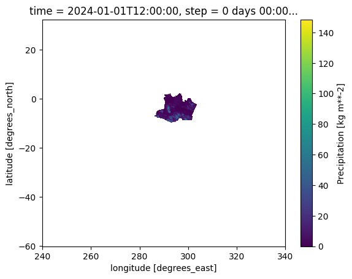
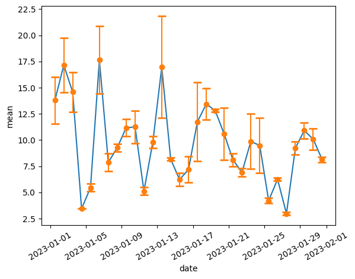

Como Usar o Merge
=================

.. code:: ipython3

    !pip install matplotlib 

.. parsed-literal::

    Collecting matplotlib
      Using cached matplotlib-3.9.2-cp310-cp310-macosx_10_12_x86_64.whl.metadata (11 kB)
    Collecting contourpy>=1.0.1 (from matplotlib)
      Using cached contourpy-1.3.0-cp310-cp310-macosx_10_9_x86_64.whl.metadata (5.4 kB)
    Collecting cycler>=0.10 (from matplotlib)
      Using cached cycler-0.12.1-py3-none-any.whl.metadata (3.8 kB)
    Collecting fonttools>=4.22.0 (from matplotlib)
      Using cached fonttools-4.54.1-cp310-cp310-macosx_10_9_universal2.whl.metadata (163 kB)
    Collecting kiwisolver>=1.3.1 (from matplotlib)
      Using cached kiwisolver-1.4.7-cp310-cp310-macosx_10_9_x86_64.whl.metadata (6.3 kB)
    Requirement already satisfied: numpy>=1.23 in /Users/felipeomello/opt/anaconda3/envs/mask4/lib/python3.10/site-packages (from matplotlib) (2.1.2)
    Requirement already satisfied: packaging>=20.0 in /Users/felipeomello/opt/anaconda3/envs/mask4/lib/python3.10/site-packages (from matplotlib) (24.1)
    Collecting pillow>=8 (from matplotlib)
      Using cached pillow-10.4.0-cp310-cp310-macosx_10_10_x86_64.whl.metadata (9.2 kB)
    Collecting pyparsing>=2.3.1 (from matplotlib)
      Using cached pyparsing-3.1.4-py3-none-any.whl.metadata (5.1 kB)
    Requirement already satisfied: python-dateutil>=2.7 in /Users/felipeomello/opt/anaconda3/envs/mask4/lib/python3.10/site-packages (from matplotlib) (2.9.0)
    Requirement already satisfied: six>=1.5 in /Users/felipeomello/opt/anaconda3/envs/mask4/lib/python3.10/site-packages (from python-dateutil>=2.7->matplotlib) (1.16.0)
    Using cached matplotlib-3.9.2-cp310-cp310-macosx_10_12_x86_64.whl (7.9 MB)
    Using cached contourpy-1.3.0-cp310-cp310-macosx_10_9_x86_64.whl (265 kB)
    Using cached cycler-0.12.1-py3-none-any.whl (8.3 kB)
    Using cached fonttools-4.54.1-cp310-cp310-macosx_10_9_universal2.whl (2.8 MB)
    Using cached kiwisolver-1.4.7-cp310-cp310-macosx_10_9_x86_64.whl (65 kB)
    Using cached pillow-10.4.0-cp310-cp310-macosx_10_10_x86_64.whl (3.5 MB)
    Using cached pyparsing-3.1.4-py3-none-any.whl (104 kB)
    Installing collected packages: pyparsing, pillow, kiwisolver, fonttools, cycler, contourpy, matplotlib
    Successfully installed contourpy-1.3.0 cycler-0.12.1 fonttools-4.54.1 kiwisolver-1.4.7 matplotlib-3.9.2 pillow-10.4.0 pyparsing-3.1.4

.. code:: ipython3

    import products.CPTEC_MERGE as MRG
    mrg = MRG.products()

.. parsed-literal::

    --------------------
    --------------------
    Products: {'daily', 'climatology', 'hourly', 'hourly_now'}
    --------------------
    Accumulated: {'monthly_accumulated', 'daily_average', 'monthly_accumulated_yearly', 'year_accumulated', 'monthly_average_yearly', 'monthly_average'}
    --------------------

.. code:: ipython3

    mrg.help()

.. parsed-literal::

    Help on class products in module src.CPTEC_MERGE:
    
    class products(builtins.object)
     |  Methods defined here:
     |  
     |  __clean__()
     |      When the request process is interrupted, the tool will not remove the temporary files. 
     |      This function removes any temporary directory that has been on the disk for more than 2 days.
     |  
     |  __get_product__(self)
     |      Function to read the product from the server self.dict[‘server’][‘ftp’].
     |  
     |  __init__(self)
     |      Function to initialize the MERGE configurator, 
     |      returns an object with the load/load_range functions enabled for use
     |  
     |  help(self)
     |      Function to generate data statistics.
     |  
     |  list_areas(self, tipo=None)
     |      Function to display and return the abbreviations used in the shapefile definitions to clip the area.
     |      
     |      Parameters
     |      ----------
     |      tipo      - Required  : Type to filter areas 
     |                              (e.g. 'paises', 'regioes',
     |                                 'estados', 'bacias', 'biomas') (Str)
     |      
     |      
     |      Returns
     |      -------
     |      json : Json
     |          The newly Json.
     |  
     |  load(self, product='daily', accumulated=None, year='2024', month='01', day='01', hour='00')
     |      The load function loads the requested data from the CPTEC server into memory.
     |      
     |      During execution, a temporary directory is created to handle the files 
     |      and is deleted as soon as the request is completed."
     |      
     |          Parameters
     |          ----------
     |          product      - Optional  : 'climatology', 'hourly', 'hourly_now', 'daily' (Str)
     |          accumulated  - Optional  : 'monthly_average', 'monthly_accumulated_yearly',
     |                                 'year_accumulated', 'monthly_accumulated', 'daily_average', 
     |                                 'monthly_average_yearly'
     |      
     |                                 None for 'hourly', 'hourly_now', 'daily' (Str)
     |      
     |          year         - Optional  : year (Str)
     |          month        - Optional  : month (Str)
     |          day          - Optional  : day (Str)
     |          hour         - Optional  : hour (Str)
     |      
     |      ------------------------------------------------------------------------------------------------------------       
     |      
     |      load(product='daily', accumulated=None, year="2024", month="01", day="01", hour="00")
     |      
     |      ------------------------------------------------------------------------------------------------------------       
     |      
     |          Returns
     |          -------
     |          dataset : Dataset
     |              The newly created dataset.
     |  
     |  load_range(self, product='daily', accumulated=None, start='2023-01-01T00:00', stop='2023-02-01T00:00', step='1', unit='D', bar=True)
     |      The load_range function loads a range the requested data from the CPTEC server 
     |      into memory.
     |      
     |      During execution, a temporary directory is created to handle the files 
     |      and is deleted as soon as the request is completed."
     |      
     |      Parameters
     |      ----------
     |      product      - Optional  : 'climatology', 'hourly', 'hourly_now', 'daily' (Str)
     |      accumulated  - Optional  : 'monthly_average', 'monthly_accumulated_yearly',
     |                                 'year_accumulated', 'monthly_accumulated', 'daily_average', 
     |                                 'monthly_average_yearly'
     |      
     |                                 None for 'hourly', 'hourly_now', 'daily' (Str)
     |      
     |      start         - Optional  : start of interval. The interval includes this value. (datetime64[h])
     |      stop          - Optional  : end of interval. The interval does not include this value,(datetime64[h])
     |      step          - Optional  : spacing between values.  (Int)
     |      unit          - Optional  : time units (Str)
     |                                  'Y' - generates dates with a yearly frequency.
     |                                  'M' - generates dates with a monthly frequency.
     |                                  'D' - generates dates with a daily frequency.
     |                                  'h' - generates times with an hourly frequency.                                  
     |      
     |      bar           - Optional  : show progress bar (True/False) Default: True
     |      
     |      ------------------------------------------------------------------------------------------------------------       
     |      
     |      load_range(product='daily', accumulated=None, start='2023-01-01T00:00', 
     |                          stop='2023-02-01T00:00', step='1', unit='D', bar = True)
     |      
     |      ------------------------------------------------------------------------------------------------------------       
     |      
     |      Returns
     |      -------
     |      dataset : Dataset
     |          The newly created dataset.
     |  
     |  load_range_shape(self, product='daily', accumulated=None, start='2023-01-01T00:00', stop='2023-02-01T00:00', step='1', unit='D', bar=True, shp='estados_sp')
     |      The load_range function loads a range the requested data from the CPTEC server 
     |      into memory and cuts the defined shape.
     |      
     |      
     |      Parameters
     |      ----------
     |      product      - Optional  : 'climatology', 'hourly', 'hourly_now', 'daily' (Str)
     |      accumulated  - Optional  : 'monthly_average', 'monthly_accumulated_yearly',
     |                                 'year_accumulated', 'monthly_accumulated', 'daily_average', 
     |                                 'monthly_average_yearly'
     |      
     |                                 None for 'hourly', 'hourly_now', 'daily' (Str)
     |      
     |      start         - Optional  : start of interval. The interval includes this value. (datetime64[h])
     |      stop          - Optional  : end of interval. The interval does not include this value,(datetime64[h])
     |      step          - Optional  : spacing between values.  (Int)
     |      unit          - Optional  : time units (Str)
     |                                  'Y' - generates dates with a yearly frequency.
     |                                  'M' - generates dates with a monthly frequency.
     |                                  'D' - generates dates with a daily frequency.
     |                                  'h' - generates times with an hourly frequency.     
     |      
     |      
     |      
     |      bar           - Optional  : show progress bar (True/False) Default: True
     |      shp          - Optional  : shape (Str) -  see function list_areas()
     |      
     |      ------------------------------------------------------------------------------------------------------------       
     |      
     |      load_range(product='daily', accumulated=None, start='2023-01-01T00:00', 
     |                          stop='2023-02-01T00:00', step='1', unit='D', bar = True)
     |      
     |      ------------------------------------------------------------------------------------------------------------       
     |      
     |      Returns
     |      -------
     |      dataset : Dataset
     |          The newly created dataset.
     |  
     |  load_shape(self, product='daily', accumulated=None, year='2024', month='01', day='01', hour='00', shp='estados_sp')
     |      The load_shape function loads the requested data from the CPTEC server 
     |      into memory and cuts the defined shape.
     |      
     |      
     |          Parameters
     |          ----------
     |          product      - Optional  : 'climatology', 'hourly', 'hourly_now', 'daily' (Str)
     |          accumulated  - Optional  : 'monthly_average', 'monthly_accumulated_yearly',
     |                                 'year_accumulated', 'monthly_accumulated', 'daily_average', 
     |                                 'monthly_average_yearly'
     |      
     |                                 None for 'hourly', 'hourly_now', 'daily' (Str)
     |      
     |          year         - Optional  : year (Str)
     |          month        - Optional  : month (Str)
     |          day          - Optional  : day (Str)
     |          hour         - Optional  : hour (Str)
     |          shp          - Optional  : shape (Str) -  see function list_areas()
     |      
     |      ------------------------------------------------------------------------------------------------------------       
     |      
     |      load(product='daily', accumulated=None, year="2024", month="01", day="01", hour="00")
     |      
     |      ------------------------------------------------------------------------------------------------------------       
     |      
     |          Returns
     |          -------
     |          dataset : Dataset
     |              The newly created dataset.
     |  
     |  makeMask(self, lon, lat, res, shapefile)
     |  
     |  stats(self, ds, var)
     |      Function to generate data statistics.
     |      
     |      
     |      Parameters
     |      ----------
     |      ds      - Required  : Data to calculate (Dataset)
     |      var     - Required  : Variable to filter (Str)
     |      
     |      Returns
     |      -------
     |      dataframe : Dataframe
     |          The newly created dataframe.
     |  
     |  ----------------------------------------------------------------------
     |  Data descriptors defined here:
     |  
     |  __dict__
     |      dictionary for instance variables (if defined)
     |  
     |  __weakref__
     |      list of weak references to the object (if defined)
    

.. code:: ipython3

    mrg.list_products

.. parsed-literal::

    {'climatology', 'daily', 'hourly', 'hourly_now'}

.. code:: ipython3

    mrg.list_accumulated

.. parsed-literal::

    {'daily_average',
     'monthly_accumulated',
     'monthly_accumulated_yearly',
     'monthly_average',
     'monthly_average_yearly',
     'year_accumulated'}

.. code:: ipython3

    f=mrg.load(product="daily", day="01", month="01", year="2024")

.. code:: ipython3

    f

.. raw:: html

    
<svg style="position: absolute; width: 0; height: 0; overflow: hidden">
    <defs>
    <symbol id="icon-database" viewBox="0 0 32 32">
    <path d="M16 0c-8.837 0-16 2.239-16 5v4c0 2.761 7.163 5 16 5s16-2.239 16-5v-4c0-2.761-7.163-5-16-5z"></path>
    <path d="M16 17c-8.837 0-16-2.239-16-5v6c0 2.761 7.163 5 16 5s16-2.239 16-5v-6c0 2.761-7.163 5-16 5z"></path>
    <path d="M16 26c-8.837 0-16-2.239-16-5v6c0 2.761 7.163 5 16 5s16-2.239 16-5v-6c0 2.761-7.163 5-16 5z"></path>
    </symbol>
    <symbol id="icon-file-text2" viewBox="0 0 32 32">
    <path d="M28.681 7.159c-0.694-0.947-1.662-2.053-2.724-3.116s-2.169-2.030-3.116-2.724c-1.612-1.182-2.393-1.319-2.841-1.319h-15.5c-1.378 0-2.5 1.121-2.5 2.5v27c0 1.378 1.122 2.5 2.5 2.5h23c1.378 0 2.5-1.122 2.5-2.5v-19.5c0-0.448-0.137-1.23-1.319-2.841zM24.543 5.457c0.959 0.959 1.712 1.825 2.268 2.543h-4.811v-4.811c0.718 0.556 1.584 1.309 2.543 2.268zM28 29.5c0 0.271-0.229 0.5-0.5 0.5h-23c-0.271 0-0.5-0.229-0.5-0.5v-27c0-0.271 0.229-0.5 0.5-0.5 0 0 15.499-0 15.5 0v7c0 0.552 0.448 1 1 1h7v19.5z"></path>
    <path d="M23 26h-14c-0.552 0-1-0.448-1-1s0.448-1 1-1h14c0.552 0 1 0.448 1 1s-0.448 1-1 1z"></path>
    <path d="M23 22h-14c-0.552 0-1-0.448-1-1s0.448-1 1-1h14c0.552 0 1 0.448 1 1s-0.448 1-1 1z"></path>
    <path d="M23 18h-14c-0.552 0-1-0.448-1-1s0.448-1 1-1h14c0.552 0 1 0.448 1 1s-0.448 1-1 1z"></path>
    </symbol>
    </defs>
    </svg>
    <pre class='xr-text-repr-fallback'>&lt;xarray.Dataset&gt; Size: 7MB
    Dimensions:     (lat: 924, lon: 1001)
    Coordinates:
        time        datetime64[ns] 8B ...
        step        timedelta64[ns] 8B ...
        surface     float64 8B ...
      * lat         (lat) float64 7kB -60.05 -59.95 -59.85 ... 32.05 32.15 32.25
      * lon         (lon) float64 8kB 239.9 240.0 240.1 240.2 ... 339.8 339.9 339.9
        valid_time  datetime64[ns] 8B ...
    Data variables:
        prec        (lat, lon) float32 4MB ...
        prmsl       (lat, lon) float32 4MB ...
    Attributes:
        GRIB_edition:            2
        GRIB_centre:             consensus
        GRIB_centreDescription:  Consensus
        GRIB_subCentre:          0
        Conventions:             CF-1.7
        institution:             Consensus
        history:                 2024-10-16T16:00 GRIB to CDM+CF via cfgrib-0.9.1...</pre>

xarray.Dataset

<ul class='xr-sections'><li class='xr-section-item'><input id='section-abdd436e-eebe-484c-90ff-4c1d6c09bb7d' class='xr-section-summary-in' type='checkbox' disabled ><label for='section-abdd436e-eebe-484c-90ff-4c1d6c09bb7d' class='xr-section-summary'  title='Expand/collapse section'>Dimensions:</label>
<ul class='xr-dim-list'><li>lat: 924</li><li>lon: 1001</li></ul>

</li><li class='xr-section-item'><input id='section-66c8337c-fa9c-42be-8db3-c6dfb2701f4e' class='xr-section-summary-in' type='checkbox'  checked><label for='section-66c8337c-fa9c-42be-8db3-c6dfb2701f4e' class='xr-section-summary' >Coordinates: (6)</label>

<ul class='xr-var-list'><li class='xr-var-item'>
time

()

datetime64[ns]

...
<input id='attrs-c5bb1a39-d5eb-49fe-bb7c-7e65f11fd9b9' class='xr-var-attrs-in' type='checkbox' ><label for='attrs-c5bb1a39-d5eb-49fe-bb7c-7e65f11fd9b9' title='Show/Hide attributes'><svg class='icon xr-icon-file-text2'><use xlink:href='#icon-file-text2'></use></svg></label><input id='data-f31c9e90-a760-409f-8817-fcd50de4641c' class='xr-var-data-in' type='checkbox'><label for='data-f31c9e90-a760-409f-8817-fcd50de4641c' title='Show/Hide data repr'><svg class='icon xr-icon-database'><use xlink:href='#icon-database'></use></svg></label>
<dl class='xr-attrs'><dt>long_name :</dt><dd>initial time of forecast</dd><dt>standard_name :</dt><dd>forecast_reference_time</dd></dl>

<pre>[1 values with dtype=datetime64[ns]]</pre>
</li><li class='xr-var-item'>
step

()

timedelta64[ns]

...
<input id='attrs-e96feb3f-887e-4f7a-a4b8-b7690e8ee086' class='xr-var-attrs-in' type='checkbox' ><label for='attrs-e96feb3f-887e-4f7a-a4b8-b7690e8ee086' title='Show/Hide attributes'><svg class='icon xr-icon-file-text2'><use xlink:href='#icon-file-text2'></use></svg></label><input id='data-38561807-db01-46a8-a72b-dc62a19d9dcb' class='xr-var-data-in' type='checkbox'><label for='data-38561807-db01-46a8-a72b-dc62a19d9dcb' title='Show/Hide data repr'><svg class='icon xr-icon-database'><use xlink:href='#icon-database'></use></svg></label>
<dl class='xr-attrs'><dt>long_name :</dt><dd>time since forecast_reference_time</dd><dt>standard_name :</dt><dd>forecast_period</dd></dl>

<pre>[1 values with dtype=timedelta64[ns]]</pre>
</li><li class='xr-var-item'>
surface

()

float64

...
<input id='attrs-47aa973d-db55-4dcd-bf89-5709c958af47' class='xr-var-attrs-in' type='checkbox' ><label for='attrs-47aa973d-db55-4dcd-bf89-5709c958af47' title='Show/Hide attributes'><svg class='icon xr-icon-file-text2'><use xlink:href='#icon-file-text2'></use></svg></label><input id='data-a46e1d6b-bdda-43a9-8586-c80221b0045a' class='xr-var-data-in' type='checkbox'><label for='data-a46e1d6b-bdda-43a9-8586-c80221b0045a' title='Show/Hide data repr'><svg class='icon xr-icon-database'><use xlink:href='#icon-database'></use></svg></label>
<dl class='xr-attrs'><dt>long_name :</dt><dd>original GRIB coordinate for key: level(surface)</dd><dt>units :</dt><dd>1</dd></dl>

<pre>[1 values with dtype=float64]</pre>
</li><li class='xr-var-item'>
lat

(lat)

float64

-60.05 -59.95 ... 32.15 32.25
<input id='attrs-57a980a7-00b3-44b5-a745-695eaa5e2fa5' class='xr-var-attrs-in' type='checkbox' ><label for='attrs-57a980a7-00b3-44b5-a745-695eaa5e2fa5' title='Show/Hide attributes'><svg class='icon xr-icon-file-text2'><use xlink:href='#icon-file-text2'></use></svg></label><input id='data-99f69760-63a9-4905-8931-c25b2ef903c6' class='xr-var-data-in' type='checkbox'><label for='data-99f69760-63a9-4905-8931-c25b2ef903c6' title='Show/Hide data repr'><svg class='icon xr-icon-database'><use xlink:href='#icon-database'></use></svg></label>
<dl class='xr-attrs'><dt>units :</dt><dd>degrees_north</dd><dt>standard_name :</dt><dd>latitude</dd><dt>long_name :</dt><dd>latitude</dd></dl>

<pre>array([-60.05, -59.95, -59.85, ...,  32.05,  32.15,  32.25])</pre>
</li><li class='xr-var-item'>
lon

(lon)

float64

239.9 240.0 240.1 ... 339.9 339.9
<input id='attrs-43a75a79-e836-4150-97cb-6f3ef58af492' class='xr-var-attrs-in' type='checkbox' ><label for='attrs-43a75a79-e836-4150-97cb-6f3ef58af492' title='Show/Hide attributes'><svg class='icon xr-icon-file-text2'><use xlink:href='#icon-file-text2'></use></svg></label><input id='data-4aafef36-2f02-41e4-a9a0-d2bc0e518e1f' class='xr-var-data-in' type='checkbox'><label for='data-4aafef36-2f02-41e4-a9a0-d2bc0e518e1f' title='Show/Hide data repr'><svg class='icon xr-icon-database'><use xlink:href='#icon-database'></use></svg></label>
<dl class='xr-attrs'><dt>units :</dt><dd>degrees_east</dd><dt>standard_name :</dt><dd>longitude</dd><dt>long_name :</dt><dd>longitude</dd></dl>

<pre>array([239.95, 240.05, 240.15, ..., 339.75, 339.85, 339.95])</pre>
</li><li class='xr-var-item'>
valid_time

()

datetime64[ns]

...
<input id='attrs-e40c726c-490e-4f6a-bd0e-6107499a4565' class='xr-var-attrs-in' type='checkbox' ><label for='attrs-e40c726c-490e-4f6a-bd0e-6107499a4565' title='Show/Hide attributes'><svg class='icon xr-icon-file-text2'><use xlink:href='#icon-file-text2'></use></svg></label><input id='data-a9b3380d-64b5-4966-a34f-ef05444257ae' class='xr-var-data-in' type='checkbox'><label for='data-a9b3380d-64b5-4966-a34f-ef05444257ae' title='Show/Hide data repr'><svg class='icon xr-icon-database'><use xlink:href='#icon-database'></use></svg></label>
<dl class='xr-attrs'><dt>standard_name :</dt><dd>time</dd><dt>long_name :</dt><dd>time</dd></dl>

<pre>[1 values with dtype=datetime64[ns]]</pre>
</li></ul>
</li><li class='xr-section-item'><input id='section-4003ec7d-063f-4af7-af33-45c27c3437e9' class='xr-section-summary-in' type='checkbox'  checked><label for='section-4003ec7d-063f-4af7-af33-45c27c3437e9' class='xr-section-summary' >Data variables: (2)</label>

<ul class='xr-var-list'><li class='xr-var-item'>
prec

(lat, lon)

float32

...
<input id='attrs-392a3386-6256-4b6c-922f-57a68e0f492b' class='xr-var-attrs-in' type='checkbox' ><label for='attrs-392a3386-6256-4b6c-922f-57a68e0f492b' title='Show/Hide attributes'><svg class='icon xr-icon-file-text2'><use xlink:href='#icon-file-text2'></use></svg></label><input id='data-7e4c970d-9cb6-4282-b067-106492d7cb09' class='xr-var-data-in' type='checkbox'><label for='data-7e4c970d-9cb6-4282-b067-106492d7cb09' title='Show/Hide data repr'><svg class='icon xr-icon-database'><use xlink:href='#icon-database'></use></svg></label>
<dl class='xr-attrs'><dt>GRIB_paramId :</dt><dd>260138</dd><dt>GRIB_dataType :</dt><dd>an</dd><dt>GRIB_numberOfPoints :</dt><dd>924924</dd><dt>GRIB_typeOfLevel :</dt><dd>surface</dd><dt>GRIB_stepUnits :</dt><dd>1</dd><dt>GRIB_stepType :</dt><dd>instant</dd><dt>GRIB_gridType :</dt><dd>regular_ll</dd><dt>GRIB_uvRelativeToGrid :</dt><dd>0</dd><dt>GRIB_NV :</dt><dd>0</dd><dt>GRIB_Nx :</dt><dd>1001</dd><dt>GRIB_Ny :</dt><dd>924</dd><dt>GRIB_cfName :</dt><dd>unknown</dd><dt>GRIB_cfVarName :</dt><dd>prec</dd><dt>GRIB_gridDefinitionDescription :</dt><dd>Latitude/longitude. Also called equidistant cylindrical, or Plate Carree</dd><dt>GRIB_iDirectionIncrementInDegrees :</dt><dd>0.1</dd><dt>GRIB_iScansNegatively :</dt><dd>0</dd><dt>GRIB_jDirectionIncrementInDegrees :</dt><dd>0.1</dd><dt>GRIB_jPointsAreConsecutive :</dt><dd>0</dd><dt>GRIB_jScansPositively :</dt><dd>1</dd><dt>GRIB_latitudeOfFirstGridPointInDegrees :</dt><dd>-60.05</dd><dt>GRIB_latitudeOfLastGridPointInDegrees :</dt><dd>32.25</dd><dt>GRIB_longitudeOfFirstGridPointInDegrees :</dt><dd>239.95</dd><dt>GRIB_longitudeOfLastGridPointInDegrees :</dt><dd>339.95</dd><dt>GRIB_missingValue :</dt><dd>3.4028234663852886e+38</dd><dt>GRIB_name :</dt><dd>Precipitation</dd><dt>GRIB_shortName :</dt><dd>prec</dd><dt>GRIB_units :</dt><dd>kg m**-2</dd><dt>long_name :</dt><dd>Precipitation</dd><dt>units :</dt><dd>kg m**-2</dd><dt>standard_name :</dt><dd>unknown</dd></dl>

<pre>[924924 values with dtype=float32]</pre>
</li><li class='xr-var-item'>
prmsl

(lat, lon)

float32

...
<input id='attrs-7232c849-f4fd-468d-b4d9-e020de181989' class='xr-var-attrs-in' type='checkbox' ><label for='attrs-7232c849-f4fd-468d-b4d9-e020de181989' title='Show/Hide attributes'><svg class='icon xr-icon-file-text2'><use xlink:href='#icon-file-text2'></use></svg></label><input id='data-86204c4a-c5e6-4528-bf57-6e54163c8226' class='xr-var-data-in' type='checkbox'><label for='data-86204c4a-c5e6-4528-bf57-6e54163c8226' title='Show/Hide data repr'><svg class='icon xr-icon-database'><use xlink:href='#icon-database'></use></svg></label>
<dl class='xr-attrs'><dt>GRIB_paramId :</dt><dd>260074</dd><dt>GRIB_dataType :</dt><dd>an</dd><dt>GRIB_numberOfPoints :</dt><dd>924924</dd><dt>GRIB_typeOfLevel :</dt><dd>surface</dd><dt>GRIB_stepUnits :</dt><dd>1</dd><dt>GRIB_stepType :</dt><dd>instant</dd><dt>GRIB_gridType :</dt><dd>regular_ll</dd><dt>GRIB_uvRelativeToGrid :</dt><dd>0</dd><dt>GRIB_NV :</dt><dd>0</dd><dt>GRIB_Nx :</dt><dd>1001</dd><dt>GRIB_Ny :</dt><dd>924</dd><dt>GRIB_cfName :</dt><dd>unknown</dd><dt>GRIB_cfVarName :</dt><dd>prmsl</dd><dt>GRIB_gridDefinitionDescription :</dt><dd>Latitude/longitude. Also called equidistant cylindrical, or Plate Carree</dd><dt>GRIB_iDirectionIncrementInDegrees :</dt><dd>0.1</dd><dt>GRIB_iScansNegatively :</dt><dd>0</dd><dt>GRIB_jDirectionIncrementInDegrees :</dt><dd>0.1</dd><dt>GRIB_jPointsAreConsecutive :</dt><dd>0</dd><dt>GRIB_jScansPositively :</dt><dd>1</dd><dt>GRIB_latitudeOfFirstGridPointInDegrees :</dt><dd>-60.05</dd><dt>GRIB_latitudeOfLastGridPointInDegrees :</dt><dd>32.25</dd><dt>GRIB_longitudeOfFirstGridPointInDegrees :</dt><dd>239.95</dd><dt>GRIB_longitudeOfLastGridPointInDegrees :</dt><dd>339.95</dd><dt>GRIB_missingValue :</dt><dd>3.4028234663852886e+38</dd><dt>GRIB_name :</dt><dd>Pressure reduced to MSL</dd><dt>GRIB_shortName :</dt><dd>prmsl</dd><dt>GRIB_units :</dt><dd>Pa</dd><dt>long_name :</dt><dd>Pressure reduced to MSL</dd><dt>units :</dt><dd>Pa</dd><dt>standard_name :</dt><dd>unknown</dd></dl>

<pre>[924924 values with dtype=float32]</pre>
</li></ul>
</li><li class='xr-section-item'><input id='section-01383506-9a8a-4704-a9e0-6883d6ff82ef' class='xr-section-summary-in' type='checkbox'  ><label for='section-01383506-9a8a-4704-a9e0-6883d6ff82ef' class='xr-section-summary' >Indexes: (2)</label>

<ul class='xr-var-list'><li class='xr-var-item'>

lat

PandasIndex

<input id='index-46826807-6e29-41b6-8b0b-e8030841702a' class='xr-index-data-in' type='checkbox'/><label for='index-46826807-6e29-41b6-8b0b-e8030841702a' title='Show/Hide index repr'><svg class='icon xr-icon-database'><use xlink:href='#icon-database'></use></svg></label>
<pre>PandasIndex(Index([             -60.05, -59.949999999999996, -59.849999999999994,
            -59.74999999999999,  -59.64999999999999,  -59.54999999999999,
            -59.44999999999999,  -59.34999999999999, -59.249999999999986,
           -59.149999999999984,
           ...
            31.350000000000765,  31.450000000000767,  31.550000000000768,
             31.65000000000077,   31.75000000000077,  31.850000000000772,
            31.950000000000774,   32.05000000000077,   32.15000000000077,
                         32.25],
          dtype=&#x27;float64&#x27;, name=&#x27;lat&#x27;, length=924))</pre>
</li><li class='xr-var-item'>

lon

PandasIndex

<input id='index-d836ca2a-4254-43ae-854b-a67202739897' class='xr-index-data-in' type='checkbox'/><label for='index-d836ca2a-4254-43ae-854b-a67202739897' title='Show/Hide index repr'><svg class='icon xr-icon-database'><use xlink:href='#icon-database'></use></svg></label>
<pre>PandasIndex(Index([            239.95, 240.04999999999998, 240.14999999999998,
           240.24999999999997, 240.34999999999997, 240.44999999999996,
           240.54999999999995, 240.64999999999995, 240.74999999999994,
           240.84999999999994,
           ...
             339.050000000018,   339.150000000018,   339.250000000018,
           339.35000000001804, 339.45000000001806,  339.5500000000181,
            339.6500000000181, 339.75000000001813, 339.85000000001816,
                       339.95],
          dtype=&#x27;float64&#x27;, name=&#x27;lon&#x27;, length=1001))</pre>
</li></ul>
</li><li class='xr-section-item'><input id='section-3951fe4e-ff50-4974-a99f-c23ee9a2e2fd' class='xr-section-summary-in' type='checkbox'  checked><label for='section-3951fe4e-ff50-4974-a99f-c23ee9a2e2fd' class='xr-section-summary' >Attributes: (7)</label>

<dl class='xr-attrs'><dt>GRIB_edition :</dt><dd>2</dd><dt>GRIB_centre :</dt><dd>consensus</dd><dt>GRIB_centreDescription :</dt><dd>Consensus</dd><dt>GRIB_subCentre :</dt><dd>0</dd><dt>Conventions :</dt><dd>CF-1.7</dd><dt>institution :</dt><dd>Consensus</dd><dt>history :</dt><dd>2024-10-16T16:00 GRIB to CDM+CF via cfgrib-0.9.14.1/ecCodes-2.38.0 with {&quot;source&quot;: &quot;.temporary_files/DAILY/MERGE_CPTEC_20240101.grib2&quot;, &quot;filter_by_keys&quot;: {}, &quot;encode_cf&quot;: [&quot;parameter&quot;, &quot;time&quot;, &quot;geography&quot;, &quot;vertical&quot;]}</dd></dl>
</li></ul>

.. code:: ipython3

    f2 = mrg.load_range( product= "hourly" ,start="2024-01-01T12:00", stop="2024-01-05T12:00",  step=3,unit='h', bar=True)

.. parsed-literal::

    2024-01-05T09:00 |██████████████████████████████████████████████████| 100.0% Complete

.. code:: ipython3

    f2.time.values

.. parsed-literal::

    array(['2024-01-01T12:00:00.000000000', '2024-01-01T15:00:00.000000000',
           '2024-01-01T18:00:00.000000000', '2024-01-01T21:00:00.000000000',
           '2024-01-02T00:00:00.000000000', '2024-01-02T03:00:00.000000000',
           '2024-01-02T06:00:00.000000000', '2024-01-02T09:00:00.000000000',
           '2024-01-02T12:00:00.000000000', '2024-01-02T15:00:00.000000000',
           '2024-01-02T18:00:00.000000000', '2024-01-02T21:00:00.000000000',
           '2024-01-03T00:00:00.000000000', '2024-01-03T03:00:00.000000000',
           '2024-01-03T06:00:00.000000000', '2024-01-03T09:00:00.000000000',
           '2024-01-03T12:00:00.000000000', '2024-01-03T15:00:00.000000000',
           '2024-01-03T18:00:00.000000000', '2024-01-03T21:00:00.000000000',
           '2024-01-04T00:00:00.000000000', '2024-01-04T03:00:00.000000000',
           '2024-01-04T06:00:00.000000000', '2024-01-04T09:00:00.000000000',
           '2024-01-04T12:00:00.000000000', '2024-01-04T15:00:00.000000000',
           '2024-01-04T18:00:00.000000000', '2024-01-04T21:00:00.000000000',
           '2024-01-05T00:00:00.000000000', '2024-01-05T03:00:00.000000000',
           '2024-01-05T06:00:00.000000000', '2024-01-05T09:00:00.000000000'],
          dtype='datetime64[ns]')

.. code:: ipython3

    # tipo = (paises/regioes/estados/bacias/biomas)
    p=mrg.list_areas(tipo='estados')

.. parsed-literal::

    Usage: type_abbreviation e.g. shp='estados_sp'
    Area    -   type_abbreviation
    Acre - estados_ac
    Alagoas - estados_al
    Amazônia - estados_am
    Amapá - estados_ap
    Bahia - estados_ba
    Ceará - estados_ce
    Distrito Federal - estados_df
    Espírito Santo - estados_es
    Goiás - estados_go
    Maranhão - estados_ma
    Minas Gerais - estados_mg
    Mato Grosso do Sul - estados_ms
    Mato Grosso - estados_mt
    Pará - estados_pa
    Paraíba - estados_pb
    Pernambuco - estados_pe
    Piauí - estados_pi
    Paraná - estados_pr
    Rio de Janeiro - estados_rj
    Rio Grande do Norte - estados_rn
    Rondônia - estados_ro
    Roraima - estados_rr
    Rio Grande do Sul - estados_rs
    Santa Catarina - estados_sc
    Sergipe - estados_se
    São Paulo - estados_sp
    Tocantins - estados_to

.. code:: ipython3

    p

.. parsed-literal::

    {'AC': ['1', 'Acre'],
     'AL': ['2', 'Alagoas'],
     'AM': ['3', 'Amazônia'],
     'AP': ['4', 'Amapá'],
     'BA': ['5', 'Bahia'],
     'CE': ['6', 'Ceará'],
     'DF': ['7', 'Distrito Federal'],
     'ES': ['8', 'Espírito Santo'],
     'GO': ['9', 'Goiás'],
     'MA': ['10', 'Maranhão'],
     'MG': ['11', 'Minas Gerais'],
     'MS': ['12', 'Mato Grosso do Sul'],
     'MT': ['13', 'Mato Grosso'],
     'PA': ['14', 'Pará'],
     'PB': ['15', 'Paraíba'],
     'PE': ['16', 'Pernambuco'],
     'PI': ['17', 'Piauí'],
     'PR': ['18', 'Paraná'],
     'RJ': ['19', 'Rio de Janeiro'],
     'RN': ['20', 'Rio Grande do Norte'],
     'RO': ['21', 'Rondônia'],
     'RR': ['22', 'Roraima'],
     'RS': ['23', 'Rio Grande do Sul'],
     'SC': ['24', 'Santa Catarina'],
     'SE': ['25', 'Sergipe'],
     'SP': ['26', 'São Paulo'],
     'TO': ['27', 'Tocantins']}

.. code:: ipython3

    f3 = mrg.load_shape(shp="estados_am")

.. code:: ipython3

    f3.prec.plot()

.. parsed-literal::

    <matplotlib.collections.QuadMesh at 0x146d4cfa0>

.. code:: ipython3

    f4 = mrg.load_range_shape(shp="estados_am")

.. parsed-literal::

    2023-01-31T00:00 |██████████████████████████████████████████████████| 100.0% Complete

.. code:: ipython3

    df = mrg.stats(f4,'prec')

.. code:: ipython3

    df

.. raw:: html

    

    
    <table border="1" class="dataframe">
      <thead>
        <tr style="text-align: right;">
          <th></th>
          <th>date</th>
          <th>count</th>
          <th>mean</th>
          <th>std</th>
          <th>min</th>
          <th>25%</th>
          <th>50%</th>
          <th>75%</th>
          <th>max</th>
        </tr>
      </thead>
      <tbody>
        <tr>
          <th>0</th>
          <td>2023-01-01 12:00:00</td>
          <td>12814.0</td>
          <td>13.787273</td>
          <td>17.610474</td>
          <td>0.0</td>
          <td>2.2500</td>
          <td>7.6250</td>
          <td>18.62500</td>
          <td>169.8750</td>
        </tr>
        <tr>
          <th>1</th>
          <td>2023-01-02 12:00:00</td>
          <td>12814.0</td>
          <td>17.155123</td>
          <td>27.187271</td>
          <td>0.0</td>
          <td>2.6250</td>
          <td>7.3750</td>
          <td>19.00000</td>
          <td>265.0000</td>
        </tr>
        <tr>
          <th>2</th>
          <td>2023-01-03 12:00:00</td>
          <td>12814.0</td>
          <td>14.583434</td>
          <td>19.734922</td>
          <td>0.0</td>
          <td>1.8750</td>
          <td>7.2500</td>
          <td>18.87500</td>
          <td>180.5000</td>
        </tr>
        <tr>
          <th>3</th>
          <td>2023-01-04 12:00:00</td>
          <td>12814.0</td>
          <td>3.443792</td>
          <td>6.306174</td>
          <td>0.0</td>
          <td>0.0000</td>
          <td>0.7500</td>
          <td>3.37500</td>
          <td>67.7500</td>
        </tr>
        <tr>
          <th>4</th>
          <td>2023-01-05 12:00:00</td>
          <td>12814.0</td>
          <td>5.454074</td>
          <td>8.582157</td>
          <td>0.0</td>
          <td>0.3750</td>
          <td>2.0000</td>
          <td>7.06250</td>
          <td>148.3125</td>
        </tr>
        <tr>
          <th>5</th>
          <td>2023-01-06 12:00:00</td>
          <td>12814.0</td>
          <td>17.658878</td>
          <td>20.828644</td>
          <td>0.0</td>
          <td>3.2500</td>
          <td>11.2500</td>
          <td>24.37500</td>
          <td>171.8750</td>
        </tr>
        <tr>
          <th>6</th>
          <td>2023-01-07 12:00:00</td>
          <td>12814.0</td>
          <td>7.873790</td>
          <td>9.547367</td>
          <td>0.0</td>
          <td>0.8750</td>
          <td>4.1250</td>
          <td>11.62500</td>
          <td>125.1250</td>
        </tr>
        <tr>
          <th>7</th>
          <td>2023-01-08 12:00:00</td>
          <td>12814.0</td>
          <td>9.266900</td>
          <td>16.301550</td>
          <td>0.0</td>
          <td>0.3750</td>
          <td>2.7500</td>
          <td>10.75000</td>
          <td>163.2500</td>
        </tr>
        <tr>
          <th>8</th>
          <td>2023-01-09 12:00:00</td>
          <td>12814.0</td>
          <td>11.172644</td>
          <td>18.195629</td>
          <td>0.0</td>
          <td>0.8125</td>
          <td>3.8125</td>
          <td>13.25000</td>
          <td>166.8750</td>
        </tr>
        <tr>
          <th>9</th>
          <td>2023-01-10 12:00:00</td>
          <td>12814.0</td>
          <td>11.256804</td>
          <td>14.313355</td>
          <td>0.0</td>
          <td>1.5625</td>
          <td>6.0625</td>
          <td>15.75000</td>
          <td>139.0625</td>
        </tr>
        <tr>
          <th>10</th>
          <td>2023-01-11 12:00:00</td>
          <td>12814.0</td>
          <td>5.126756</td>
          <td>8.242227</td>
          <td>0.0</td>
          <td>0.3750</td>
          <td>2.1250</td>
          <td>6.25000</td>
          <td>116.3750</td>
        </tr>
        <tr>
          <th>11</th>
          <td>2023-01-12 12:00:00</td>
          <td>12814.0</td>
          <td>9.810890</td>
          <td>16.128685</td>
          <td>0.0</td>
          <td>0.5625</td>
          <td>3.3750</td>
          <td>11.25000</td>
          <td>139.2500</td>
        </tr>
        <tr>
          <th>12</th>
          <td>2023-01-13 12:00:00</td>
          <td>12814.0</td>
          <td>16.984978</td>
          <td>17.260170</td>
          <td>0.0</td>
          <td>4.8750</td>
          <td>12.0000</td>
          <td>23.25000</td>
          <td>161.6250</td>
        </tr>
        <tr>
          <th>13</th>
          <td>2023-01-14 12:00:00</td>
          <td>12814.0</td>
          <td>8.179862</td>
          <td>12.178433</td>
          <td>0.0</td>
          <td>0.1250</td>
          <td>2.8750</td>
          <td>11.37500</td>
          <td>88.0000</td>
        </tr>
        <tr>
          <th>14</th>
          <td>2023-01-15 12:00:00</td>
          <td>12814.0</td>
          <td>6.228559</td>
          <td>9.122571</td>
          <td>0.0</td>
          <td>0.6250</td>
          <td>2.7500</td>
          <td>8.00000</td>
          <td>101.3750</td>
        </tr>
        <tr>
          <th>15</th>
          <td>2023-01-16 12:00:00</td>
          <td>12814.0</td>
          <td>7.181881</td>
          <td>9.486071</td>
          <td>0.0</td>
          <td>1.2500</td>
          <td>3.7500</td>
          <td>9.50000</td>
          <td>111.0000</td>
        </tr>
        <tr>
          <th>16</th>
          <td>2023-01-17 12:00:00</td>
          <td>12814.0</td>
          <td>11.748946</td>
          <td>13.542139</td>
          <td>0.0</td>
          <td>3.7500</td>
          <td>8.2500</td>
          <td>15.50000</td>
          <td>191.6250</td>
        </tr>
        <tr>
          <th>17</th>
          <td>2023-01-18 12:00:00</td>
          <td>12814.0</td>
          <td>13.441226</td>
          <td>16.522987</td>
          <td>0.0</td>
          <td>1.5000</td>
          <td>7.3750</td>
          <td>19.75000</td>
          <td>145.2500</td>
        </tr>
        <tr>
          <th>18</th>
          <td>2023-01-19 12:00:00</td>
          <td>12814.0</td>
          <td>12.815329</td>
          <td>24.788092</td>
          <td>0.0</td>
          <td>0.1250</td>
          <td>2.6250</td>
          <td>14.75000</td>
          <td>267.1250</td>
        </tr>
        <tr>
          <th>19</th>
          <td>2023-01-20 12:00:00</td>
          <td>12814.0</td>
          <td>10.581483</td>
          <td>12.711884</td>
          <td>0.0</td>
          <td>2.5000</td>
          <td>6.2500</td>
          <td>13.87500</td>
          <td>114.5000</td>
        </tr>
        <tr>
          <th>20</th>
          <td>2023-01-21 12:00:00</td>
          <td>12814.0</td>
          <td>8.105081</td>
          <td>11.605332</td>
          <td>0.0</td>
          <td>0.6250</td>
          <td>3.6250</td>
          <td>10.75000</td>
          <td>110.1250</td>
        </tr>
        <tr>
          <th>21</th>
          <td>2023-01-22 12:00:00</td>
          <td>12814.0</td>
          <td>6.912703</td>
          <td>10.737909</td>
          <td>0.0</td>
          <td>0.3750</td>
          <td>2.5000</td>
          <td>8.84375</td>
          <td>114.8750</td>
        </tr>
        <tr>
          <th>22</th>
          <td>2023-01-23 12:00:00</td>
          <td>12814.0</td>
          <td>9.866806</td>
          <td>11.946214</td>
          <td>0.0</td>
          <td>2.6250</td>
          <td>6.1250</td>
          <td>12.25000</td>
          <td>140.6250</td>
        </tr>
        <tr>
          <th>23</th>
          <td>2023-01-24 12:00:00</td>
          <td>12814.0</td>
          <td>9.482324</td>
          <td>9.347361</td>
          <td>0.0</td>
          <td>2.6250</td>
          <td>6.8750</td>
          <td>13.50000</td>
          <td>92.1250</td>
        </tr>
        <tr>
          <th>24</th>
          <td>2023-01-25 12:00:00</td>
          <td>12814.0</td>
          <td>4.215487</td>
          <td>5.953871</td>
          <td>0.0</td>
          <td>0.2500</td>
          <td>2.2500</td>
          <td>6.00000</td>
          <td>58.0000</td>
        </tr>
        <tr>
          <th>25</th>
          <td>2023-01-26 12:00:00</td>
          <td>12814.0</td>
          <td>6.253102</td>
          <td>10.603520</td>
          <td>0.0</td>
          <td>0.1250</td>
          <td>2.1250</td>
          <td>7.00000</td>
          <td>117.2500</td>
        </tr>
        <tr>
          <th>26</th>
          <td>2023-01-27 12:00:00</td>
          <td>12814.0</td>
          <td>2.975330</td>
          <td>4.736682</td>
          <td>0.0</td>
          <td>0.1250</td>
          <td>1.1250</td>
          <td>3.75000</td>
          <td>49.3750</td>
        </tr>
        <tr>
          <th>27</th>
          <td>2023-01-28 12:00:00</td>
          <td>12814.0</td>
          <td>9.241230</td>
          <td>18.875774</td>
          <td>0.0</td>
          <td>0.6250</td>
          <td>2.7500</td>
          <td>8.50000</td>
          <td>175.6250</td>
        </tr>
        <tr>
          <th>28</th>
          <td>2023-01-29 12:00:00</td>
          <td>12814.0</td>
          <td>10.905060</td>
          <td>16.098299</td>
          <td>0.0</td>
          <td>0.7500</td>
          <td>3.6250</td>
          <td>14.43750</td>
          <td>107.4375</td>
        </tr>
        <tr>
          <th>29</th>
          <td>2023-01-30 12:00:00</td>
          <td>12814.0</td>
          <td>10.084712</td>
          <td>15.433344</td>
          <td>0.0</td>
          <td>1.0000</td>
          <td>3.7500</td>
          <td>12.50000</td>
          <td>136.5000</td>
        </tr>
        <tr>
          <th>30</th>
          <td>2023-01-31 12:00:00</td>
          <td>12814.0</td>
          <td>8.148451</td>
          <td>11.330711</td>
          <td>0.0</td>
          <td>0.2500</td>
          <td>3.0000</td>
          <td>12.50000</td>
          <td>115.5000</td>
        </tr>
      </tbody>
    </table>
    

.. code:: ipython3

    import matplotlib.pyplot as plt
    import seaborn as sns

.. code:: ipython3

    plt.xticks(rotation=30)
    sns.lineplot(data=df, x="date", y="mean")
    plt.errorbar(df['date'] ,df['mean'], yerr=df['25%'], fmt='o', capsize=5, capthick=2)

.. code:: ipython3

    f4.to_netcdf("output.nc")

.. code:: ipython3

    !open "output.nc"

