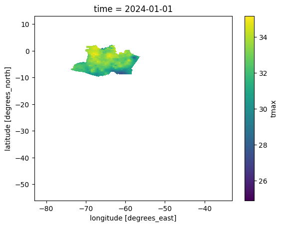
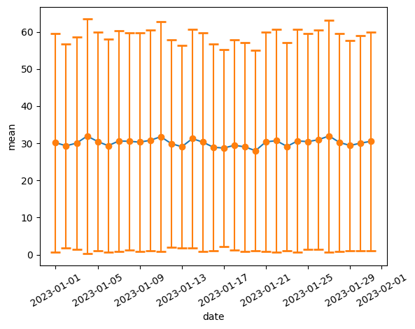

Como Usar o SAMeT
=================

.. code:: ipython3

    import products.CPTEC_SAMeT as SAM
    sam = SAM.products()

.. parsed-literal::

    --------------------
    --------------------
    Products: {'daily', 'climatology', 'hourly'}
    --------------------
    Accumulated: {'monthly_average', 'monthly_average_yearly', 'daily_average'}
    --------------------

.. code:: ipython3

    sam.help()

.. parsed-literal::

    Help on class products in module products.CPTEC_SAMeT:
    
    class products(builtins.object)
     |  Methods defined here:
     |  
     |  __clean__()
     |      When the request process is interrupted, the tool will not remove the temporary files. 
     |      This function removes any temporary directory that has been on the disk for more than 2 days.
     |  
     |  __get_product__(self)
     |      Function to read the product from the server self.dict[‘server’][‘ftp’].
     |  
     |  __init__(self)
     |      Function to initialize the MERGE configurator, 
     |      returns an object with the load/load_range functions enabled for use
     |  
     |  help(self)
     |      Function to display product information and their operations.
     |  
     |  list_areas(self, tipo=None)
     |      Function to display and return the abbreviations used in the shapefile definitions to clip the area.
     |      
     |      Parameters
     |      ----------
     |      tipo      - Required  : Type to filter areas 
     |                              (e.g. 'paises', 'regioes',
     |                                 'estados', 'bacias', 'biomas') (Str)
     |      
     |      
     |      Returns
     |      -------
     |      json : Json
     |          The newly Json.
     |  
     |  load(self, product='daily', accumulated=None, var='tmax', year='2024', month='01', day='01', hour='00')
     |      The load function loads the requested data from the CPTEC server into memory.
     |      
     |      During execution, a temporary directory is created to handle the files 
     |      and is deleted as soon as the request is completed."
     |      
     |          Parameters
     |          ----------
     |          product      - Optional  : 'climatology', 'hourly', 'hourly_now', 'daily' (Str)
     |          accumulated  - Optional  : 'monthly_average', 'monthly_accumulated_yearly',
     |                                 'year_accumulated', 'monthly_accumulated', 'daily_average', 
     |                                 'monthly_average_yearly'
     |      
     |                                 None for 'hourly', 'hourly_now', 'daily' (Str)
     |      
     |          year         - Optional  : year (Str)
     |          month        - Optional  : month (Str)
     |          day          - Optional  : day (Str)
     |          hour         - Optional  : hour (Str)
     |      
     |      ------------------------------------------------------------------------------------------------------------       
     |      
     |      load(product='daily', accumulated=None, year="2024", month="01", day="01", hour="00")
     |      
     |      ------------------------------------------------------------------------------------------------------------       
     |      
     |          Returns
     |          -------
     |          dataset : Dataset
     |              The newly created dataset.
     |  
     |  load_range(self, product='daily', var='tmax', accumulated=None, start='2023-01-01T00:00', stop='2023-02-01T00:00', step='1', unit='D', bar=True)
     |      The load_range function loads a range the requested data from the CPTEC server 
     |      into memory.
     |      
     |      During execution, a temporary directory is created to handle the files 
     |      and is deleted as soon as the request is completed."
     |      
     |      Parameters
     |      ----------
     |      product      - Optional  : 'climatology', 'hourly', 'hourly_now', 'daily' (Str)
     |      accumulated  - Optional  : 'monthly_average', 'monthly_accumulated_yearly',
     |                                 'year_accumulated', 'monthly_accumulated', 'daily_average', 
     |                                 'monthly_average_yearly'
     |      
     |                                 None for 'hourly', 'hourly_now', 'daily' (Str)
     |      
     |      start         - Optional  : start of interval. The interval includes this value. (datetime64[h])
     |      stop          - Optional  : end of interval. The interval does not include this value,(datetime64[h])
     |      step          - Optional  : spacing between values.  (Int)
     |      unit          - Optional  : time units (Str)
     |                                  'Y' - generates dates with a yearly frequency.
     |                                  'M' - generates dates with a monthly frequency.
     |                                  'D' - generates dates with a daily frequency.
     |                                  'h' - generates times with an hourly frequency.                                    'D' - generates dates with a daily frequency.
     |      
     |      bar           - Optional  : show progress bar (True/False) Default: True
     |      
     |      ------------------------------------------------------------------------------------------------------------       
     |      
     |      load_range(product='daily', accumulated=None, start='2023-01-01T00:00', 
     |                          stop='2023-02-01T00:00', step='1', unit='D', bar = True)
     |      
     |      ------------------------------------------------------------------------------------------------------------       
     |      
     |      Returns
     |      -------
     |      dataset : Dataset
     |          The newly created dataset.
     |  
     |  load_range_shape(self, var='tmax', product='daily', accumulated=None, start='2023-01-01T00:00', stop='2023-02-01T00:00', step='1', unit='D', bar=True, shp='estados_sp')
     |      The load_range function loads a range the requested data from the CPTEC server 
     |      into memory and cuts the defined shape.
     |      
     |      
     |      Parameters
     |      ----------
     |      product      - Optional  : 'climatology', 'hourly', 'hourly_now', 'daily' (Str)
     |      accumulated  - Optional  : 'monthly_average', 'monthly_accumulated_yearly',
     |                                 'year_accumulated', 'monthly_accumulated', 'daily_average', 
     |                                 'monthly_average_yearly'
     |      
     |                                 None for 'hourly', 'hourly_now', 'daily' (Str)
     |      
     |      start         - Optional  : start of interval. The interval includes this value. (datetime64[h])
     |      stop          - Optional  : end of interval. The interval does not include this value,(datetime64[h])
     |      step          - Optional  : spacing between values.  (Int)
     |      unit          - Optional  : time units (Str)
     |                                  'Y' - generates dates with a yearly frequency.
     |                                  'M' - generates dates with a monthly frequency.
     |                                  'D' - generates dates with a daily frequency.
     |                                  'h' - generates times with an hourly frequency.     
     |      
     |      
     |      
     |      bar           - Optional  : show progress bar (True/False) Default: True
     |      shp          - Optional  : shape (Str) -  see function list_areas()
     |      
     |      ------------------------------------------------------------------------------------------------------------       
     |      
     |      load_range(product='daily', accumulated=None, start='2023-01-01T00:00', 
     |                          stop='2023-02-01T00:00', step='1', unit='D', bar = True)
     |      
     |      ------------------------------------------------------------------------------------------------------------       
     |      
     |      Returns
     |      -------
     |      dataset : Dataset
     |          The newly created dataset.
     |  
     |  load_shape(self, var='tmax', product='daily', accumulated=None, year='2024', month='01', day='01', hour='00', shp='estados_sp')
     |      The load_shape function loads the requested data from the CPTEC server 
     |      into memory and cuts the defined shape.
     |      
     |      
     |          Parameters
     |          ----------
     |          product      - Optional  : 'climatology', 'hourly', 'hourly_now', 'daily' (Str)
     |          accumulated  - Optional  : 'monthly_average', 'monthly_accumulated_yearly',
     |                                 'year_accumulated', 'monthly_accumulated', 'daily_average', 
     |                                 'monthly_average_yearly'
     |      
     |                                 None for 'hourly', 'hourly_now', 'daily' (Str)
     |      
     |          year         - Optional  : year (Str)
     |          month        - Optional  : month (Str)
     |          day          - Optional  : day (Str)
     |          hour         - Optional  : hour (Str)
     |          shp          - Optional  : shape (Str) -  see function list_areas()
     |      
     |      ------------------------------------------------------------------------------------------------------------       
     |      
     |      load(product='daily', accumulated=None, year="2024", month="01", day="01", hour="00")
     |      
     |      ------------------------------------------------------------------------------------------------------------       
     |      
     |          Returns
     |          -------
     |          dataset : Dataset
     |              The newly created dataset.
     |  
     |  makeMask(self, lon, lat, res, shapefile)
     |  
     |  stats(self, ds, var)
     |      Function to generate data statistics.
     |      
     |      
     |      Parameters
     |      ----------
     |      ds      - Required  : Data to calculate (Dataset)
     |      var     - Required  : Variable to filter (Str)
     |      
     |      Returns
     |      -------
     |      dataframe : Dataframe
     |          The newly created dataframe.
     |  
     |  ----------------------------------------------------------------------
     |  Data descriptors defined here:
     |  
     |  __dict__
     |      dictionary for instance variables (if defined)
     |  
     |  __weakref__
     |      list of weak references to the object (if defined)
    

.. code:: ipython3

    sam.list_products

.. parsed-literal::

    {'climatology', 'daily', 'hourly'}

.. code:: ipython3

    sam.list_accumulated

.. parsed-literal::

    {'daily_average', 'monthly_average', 'monthly_average_yearly'}

.. code:: ipython3

    f=sam.load(product="daily", day="01", month="01", year="2024")

.. code:: ipython3

    f

.. raw:: html

    
<svg style="position: absolute; width: 0; height: 0; overflow: hidden">
    <defs>
    <symbol id="icon-database" viewBox="0 0 32 32">
    <path d="M16 0c-8.837 0-16 2.239-16 5v4c0 2.761 7.163 5 16 5s16-2.239 16-5v-4c0-2.761-7.163-5-16-5z"></path>
    <path d="M16 17c-8.837 0-16-2.239-16-5v6c0 2.761 7.163 5 16 5s16-2.239 16-5v-6c0 2.761-7.163 5-16 5z"></path>
    <path d="M16 26c-8.837 0-16-2.239-16-5v6c0 2.761 7.163 5 16 5s16-2.239 16-5v-6c0 2.761-7.163 5-16 5z"></path>
    </symbol>
    <symbol id="icon-file-text2" viewBox="0 0 32 32">
    <path d="M28.681 7.159c-0.694-0.947-1.662-2.053-2.724-3.116s-2.169-2.030-3.116-2.724c-1.612-1.182-2.393-1.319-2.841-1.319h-15.5c-1.378 0-2.5 1.121-2.5 2.5v27c0 1.378 1.122 2.5 2.5 2.5h23c1.378 0 2.5-1.122 2.5-2.5v-19.5c0-0.448-0.137-1.23-1.319-2.841zM24.543 5.457c0.959 0.959 1.712 1.825 2.268 2.543h-4.811v-4.811c0.718 0.556 1.584 1.309 2.543 2.268zM28 29.5c0 0.271-0.229 0.5-0.5 0.5h-23c-0.271 0-0.5-0.229-0.5-0.5v-27c0-0.271 0.229-0.5 0.5-0.5 0 0 15.499-0 15.5 0v7c0 0.552 0.448 1 1 1h7v19.5z"></path>
    <path d="M23 26h-14c-0.552 0-1-0.448-1-1s0.448-1 1-1h14c0.552 0 1 0.448 1 1s-0.448 1-1 1z"></path>
    <path d="M23 22h-14c-0.552 0-1-0.448-1-1s0.448-1 1-1h14c0.552 0 1 0.448 1 1s-0.448 1-1 1z"></path>
    <path d="M23 18h-14c-0.552 0-1-0.448-1-1s0.448-1 1-1h14c0.552 0 1 0.448 1 1s-0.448 1-1 1z"></path>
    </symbol>
    </defs>
    </svg>
    <pre class='xr-text-repr-fallback'>&lt;xarray.Dataset&gt; Size: 22MB
    Dimensions:  (lon: 1001, lat: 1381, time: 1)
    Coordinates:
      * lon      (lon) float64 8kB -83.0 -82.95 -82.9 -82.85 ... -33.1 -33.05 -33.0
      * lat      (lat) float64 11kB -56.0 -55.95 -55.9 -55.85 ... 12.9 12.95 13.0
      * time     (time) datetime64[ns] 8B 2024-01-01
    Data variables:
        tmax     (time, lat, lon) float64 11MB ...
        nobs     (time, lat, lon) float64 11MB ...
    Attributes:
        CDI:          Climate Data Interface version 1.8.2 (http://mpimet.mpg.de/...
        Conventions:  CF-1.6
        CDO:          Climate Data Operators version 1.8.2 (http://mpimet.mpg.de/...</pre>

xarray.Dataset

<ul class='xr-sections'><li class='xr-section-item'><input id='section-fa4222a0-aae0-4d11-aad2-b25dc2fc16bf' class='xr-section-summary-in' type='checkbox' disabled ><label for='section-fa4222a0-aae0-4d11-aad2-b25dc2fc16bf' class='xr-section-summary'  title='Expand/collapse section'>Dimensions:</label>
<ul class='xr-dim-list'><li>lon: 1001</li><li>lat: 1381</li><li>time: 1</li></ul>

</li><li class='xr-section-item'><input id='section-dff654e0-f44f-40de-826a-8d3f627a25d5' class='xr-section-summary-in' type='checkbox'  checked><label for='section-dff654e0-f44f-40de-826a-8d3f627a25d5' class='xr-section-summary' >Coordinates: (3)</label>

<ul class='xr-var-list'><li class='xr-var-item'>
lon

(lon)

float64

-83.0 -82.95 -82.9 ... -33.05 -33.0
<input id='attrs-25db910d-9778-4e28-853a-138c1ef1428b' class='xr-var-attrs-in' type='checkbox' ><label for='attrs-25db910d-9778-4e28-853a-138c1ef1428b' title='Show/Hide attributes'><svg class='icon xr-icon-file-text2'><use xlink:href='#icon-file-text2'></use></svg></label><input id='data-e4e50c07-4ab3-4d42-8b81-6d0ab26a7e1b' class='xr-var-data-in' type='checkbox'><label for='data-e4e50c07-4ab3-4d42-8b81-6d0ab26a7e1b' title='Show/Hide data repr'><svg class='icon xr-icon-database'><use xlink:href='#icon-database'></use></svg></label>
<dl class='xr-attrs'><dt>standard_name :</dt><dd>longitude</dd><dt>long_name :</dt><dd>longitude</dd><dt>units :</dt><dd>degrees_east</dd><dt>axis :</dt><dd>X</dd></dl>

<pre>array([-83.  , -82.95, -82.9 , ..., -33.1 , -33.05, -33.  ])</pre>
</li><li class='xr-var-item'>
lat

(lat)

float64

-56.0 -55.95 -55.9 ... 12.95 13.0
<input id='attrs-a94a4cf5-7f78-4daa-8cb6-fd36c57ec001' class='xr-var-attrs-in' type='checkbox' ><label for='attrs-a94a4cf5-7f78-4daa-8cb6-fd36c57ec001' title='Show/Hide attributes'><svg class='icon xr-icon-file-text2'><use xlink:href='#icon-file-text2'></use></svg></label><input id='data-db965b82-e967-4c65-906c-273488939da7' class='xr-var-data-in' type='checkbox'><label for='data-db965b82-e967-4c65-906c-273488939da7' title='Show/Hide data repr'><svg class='icon xr-icon-database'><use xlink:href='#icon-database'></use></svg></label>
<dl class='xr-attrs'><dt>standard_name :</dt><dd>latitude</dd><dt>long_name :</dt><dd>latitude</dd><dt>units :</dt><dd>degrees_north</dd><dt>axis :</dt><dd>Y</dd></dl>

<pre>array([-56.  , -55.95, -55.9 , ...,  12.9 ,  12.95,  13.  ])</pre>
</li><li class='xr-var-item'>
time

(time)

datetime64[ns]

2024-01-01
<input id='attrs-d9edaa80-5bba-42d5-bd5c-222244d7c691' class='xr-var-attrs-in' type='checkbox' ><label for='attrs-d9edaa80-5bba-42d5-bd5c-222244d7c691' title='Show/Hide attributes'><svg class='icon xr-icon-file-text2'><use xlink:href='#icon-file-text2'></use></svg></label><input id='data-b14b90fb-27b8-47d7-932c-78ab7be467c1' class='xr-var-data-in' type='checkbox'><label for='data-b14b90fb-27b8-47d7-932c-78ab7be467c1' title='Show/Hide data repr'><svg class='icon xr-icon-database'><use xlink:href='#icon-database'></use></svg></label>
<dl class='xr-attrs'><dt>standard_name :</dt><dd>time</dd><dt>long_name :</dt><dd>Time</dd><dt>axis :</dt><dd>T</dd></dl>

<pre>array([&#x27;2024-01-01T00:00:00.000000000&#x27;], dtype=&#x27;datetime64[ns]&#x27;)</pre>
</li></ul>
</li><li class='xr-section-item'><input id='section-748c9695-2512-448f-a83b-b8f7598b38de' class='xr-section-summary-in' type='checkbox'  checked><label for='section-748c9695-2512-448f-a83b-b8f7598b38de' class='xr-section-summary' >Data variables: (2)</label>

<ul class='xr-var-list'><li class='xr-var-item'>
tmax

(time, lat, lon)

float64

...
<input id='attrs-8c975c6a-ecc9-4cc6-9e6d-792c2955f5da' class='xr-var-attrs-in' type='checkbox' disabled><label for='attrs-8c975c6a-ecc9-4cc6-9e6d-792c2955f5da' title='Show/Hide attributes'><svg class='icon xr-icon-file-text2'><use xlink:href='#icon-file-text2'></use></svg></label><input id='data-9f074ab1-5d4c-4337-9788-93c57a8cc762' class='xr-var-data-in' type='checkbox'><label for='data-9f074ab1-5d4c-4337-9788-93c57a8cc762' title='Show/Hide data repr'><svg class='icon xr-icon-database'><use xlink:href='#icon-database'></use></svg></label>
<dl class='xr-attrs'></dl>

<pre>[1382381 values with dtype=float64]</pre>
</li><li class='xr-var-item'>
nobs

(time, lat, lon)

float64

...
<input id='attrs-f3f46855-9376-4983-9c82-e76527c79612' class='xr-var-attrs-in' type='checkbox' disabled><label for='attrs-f3f46855-9376-4983-9c82-e76527c79612' title='Show/Hide attributes'><svg class='icon xr-icon-file-text2'><use xlink:href='#icon-file-text2'></use></svg></label><input id='data-ee86902f-547b-42f3-b5c4-5c0e7c82605a' class='xr-var-data-in' type='checkbox'><label for='data-ee86902f-547b-42f3-b5c4-5c0e7c82605a' title='Show/Hide data repr'><svg class='icon xr-icon-database'><use xlink:href='#icon-database'></use></svg></label>
<dl class='xr-attrs'></dl>

<pre>[1382381 values with dtype=float64]</pre>
</li></ul>
</li><li class='xr-section-item'><input id='section-0166749b-94f9-47c2-b177-346c8bb84411' class='xr-section-summary-in' type='checkbox'  ><label for='section-0166749b-94f9-47c2-b177-346c8bb84411' class='xr-section-summary' >Indexes: (3)</label>

<ul class='xr-var-list'><li class='xr-var-item'>

lon

PandasIndex

<input id='index-f66ed072-06a6-4576-9102-d99a053a8e18' class='xr-index-data-in' type='checkbox'/><label for='index-f66ed072-06a6-4576-9102-d99a053a8e18' title='Show/Hide index repr'><svg class='icon xr-icon-database'><use xlink:href='#icon-database'></use></svg></label>
<pre>PandasIndex(Index([              -83.0,              -82.95,  -82.89999999999999,
                        -82.85,               -82.8,              -82.75,
                         -82.7,  -82.64999999999999,               -82.6,
                        -82.55,
           ...
           -33.449999999999996,  -33.39999999999999, -33.349999999999994,
                         -33.3,  -33.24999999999999, -33.199999999999996,
            -33.14999999999999, -33.099999999999994,              -33.05,
            -32.99999999999999],
          dtype=&#x27;float64&#x27;, name=&#x27;lon&#x27;, length=1001))</pre>
</li><li class='xr-var-item'>

lat

PandasIndex

<input id='index-9b781906-261d-48cb-af02-4e255b1c7dc7' class='xr-index-data-in' type='checkbox'/><label for='index-9b781906-261d-48cb-af02-4e255b1c7dc7' title='Show/Hide index repr'><svg class='icon xr-icon-database'><use xlink:href='#icon-database'></use></svg></label>
<pre>PandasIndex(Index([              -56.0, -55.949999999999996,               -55.9,
           -55.849999999999994,               -55.8,              -55.75,
           -55.699999999999996,              -55.65, -55.599999999999994,
                        -55.55,
           ...
            12.550000000000011,  12.600000000000009,  12.650000000000006,
            12.700000000000003,               12.75,  12.800000000000011,
            12.850000000000009,  12.900000000000006,  12.950000000000003,
                          13.0],
          dtype=&#x27;float64&#x27;, name=&#x27;lat&#x27;, length=1381))</pre>
</li><li class='xr-var-item'>

time

PandasIndex

<input id='index-8d350fc4-2a8e-4d5c-b69b-24af1c0660ab' class='xr-index-data-in' type='checkbox'/><label for='index-8d350fc4-2a8e-4d5c-b69b-24af1c0660ab' title='Show/Hide index repr'><svg class='icon xr-icon-database'><use xlink:href='#icon-database'></use></svg></label>
<pre>PandasIndex(DatetimeIndex([&#x27;2024-01-01&#x27;], dtype=&#x27;datetime64[ns]&#x27;, name=&#x27;time&#x27;, freq=None))</pre>
</li></ul>
</li><li class='xr-section-item'><input id='section-dcf2a38c-0c10-46f2-a210-49b0b2b0dda6' class='xr-section-summary-in' type='checkbox'  checked><label for='section-dcf2a38c-0c10-46f2-a210-49b0b2b0dda6' class='xr-section-summary' >Attributes: (3)</label>

<dl class='xr-attrs'><dt>CDI :</dt><dd>Climate Data Interface version 1.8.2 (http://mpimet.mpg.de/cdi)</dd><dt>Conventions :</dt><dd>CF-1.6</dd><dt>CDO :</dt><dd>Climate Data Operators version 1.8.2 (http://mpimet.mpg.de/cdo)</dd></dl>
</li></ul>

.. code:: ipython3

    f2 = sam.load_range( product= "hourly" ,start="2024-01-01T12:00", stop="2024-01-05T12:00",  step=3,unit='h', bar=True)

.. parsed-literal::

    2024-01-05T09:00 |██████████████████████████████████████████████████| 100.0% Complete

.. code:: ipython3

    f2.time.values

.. parsed-literal::

    array(['2024-01-01T00:00:00.000000000', '2024-01-01T00:00:00.000000000',
           '2024-01-01T00:00:00.000000000', '2024-01-01T00:00:00.000000000',
           '2024-01-02T00:00:00.000000000', '2024-01-02T00:00:00.000000000',
           '2024-01-02T00:00:00.000000000', '2024-01-02T00:00:00.000000000',
           '2024-01-02T00:00:00.000000000', '2024-01-02T00:00:00.000000000',
           '2024-01-02T00:00:00.000000000', '2024-01-02T00:00:00.000000000',
           '2024-01-03T00:00:00.000000000', '2024-01-03T00:00:00.000000000',
           '2024-01-03T00:00:00.000000000', '2024-01-03T00:00:00.000000000',
           '2024-01-03T00:00:00.000000000', '2024-01-03T00:00:00.000000000',
           '2024-01-03T00:00:00.000000000', '2024-01-03T00:00:00.000000000',
           '2024-01-04T00:00:00.000000000', '2024-01-04T00:00:00.000000000',
           '2024-01-04T00:00:00.000000000', '2024-01-04T00:00:00.000000000',
           '2024-01-04T00:00:00.000000000', '2024-01-04T00:00:00.000000000',
           '2024-01-04T00:00:00.000000000', '2024-01-04T00:00:00.000000000',
           '2024-01-05T00:00:00.000000000', '2024-01-05T00:00:00.000000000',
           '2024-01-05T00:00:00.000000000', '2024-01-05T00:00:00.000000000'],
          dtype='datetime64[ns]')

.. code:: ipython3

    # Variavies existentes (tmax/tmin/tmed) - Default (tmax)
    f2 = sam.load_range( product= "climatology" ,accumulated="monthly_average_yearly", var="tmed", start="2024-01-01T12:00", stop="2024-05-01T12:00", unit='M')

.. parsed-literal::

    2024-04 |██████████████████████████████████████████████████| 100.0% Complete

.. code:: ipython3

    f2

.. raw:: html

    
<svg style="position: absolute; width: 0; height: 0; overflow: hidden">
    <defs>
    <symbol id="icon-database" viewBox="0 0 32 32">
    <path d="M16 0c-8.837 0-16 2.239-16 5v4c0 2.761 7.163 5 16 5s16-2.239 16-5v-4c0-2.761-7.163-5-16-5z"></path>
    <path d="M16 17c-8.837 0-16-2.239-16-5v6c0 2.761 7.163 5 16 5s16-2.239 16-5v-6c0 2.761-7.163 5-16 5z"></path>
    <path d="M16 26c-8.837 0-16-2.239-16-5v6c0 2.761 7.163 5 16 5s16-2.239 16-5v-6c0 2.761-7.163 5-16 5z"></path>
    </symbol>
    <symbol id="icon-file-text2" viewBox="0 0 32 32">
    <path d="M28.681 7.159c-0.694-0.947-1.662-2.053-2.724-3.116s-2.169-2.030-3.116-2.724c-1.612-1.182-2.393-1.319-2.841-1.319h-15.5c-1.378 0-2.5 1.121-2.5 2.5v27c0 1.378 1.122 2.5 2.5 2.5h23c1.378 0 2.5-1.122 2.5-2.5v-19.5c0-0.448-0.137-1.23-1.319-2.841zM24.543 5.457c0.959 0.959 1.712 1.825 2.268 2.543h-4.811v-4.811c0.718 0.556 1.584 1.309 2.543 2.268zM28 29.5c0 0.271-0.229 0.5-0.5 0.5h-23c-0.271 0-0.5-0.229-0.5-0.5v-27c0-0.271 0.229-0.5 0.5-0.5 0 0 15.499-0 15.5 0v7c0 0.552 0.448 1 1 1h7v19.5z"></path>
    <path d="M23 26h-14c-0.552 0-1-0.448-1-1s0.448-1 1-1h14c0.552 0 1 0.448 1 1s-0.448 1-1 1z"></path>
    <path d="M23 22h-14c-0.552 0-1-0.448-1-1s0.448-1 1-1h14c0.552 0 1 0.448 1 1s-0.448 1-1 1z"></path>
    <path d="M23 18h-14c-0.552 0-1-0.448-1-1s0.448-1 1-1h14c0.552 0 1 0.448 1 1s-0.448 1-1 1z"></path>
    </symbol>
    </defs>
    </svg>
    <pre class='xr-text-repr-fallback'>&lt;xarray.Dataset&gt; Size: 42MB
    Dimensions:  (time: 4, lat: 1381, lon: 947)
    Coordinates:
      * lon      (lon) float64 8kB -81.95 -81.9 -81.85 -81.8 ... -34.75 -34.7 -34.65
      * lat      (lat) float64 11kB -56.15 -56.1 -56.05 -56.0 ... 12.75 12.8 12.85
      * time     (time) datetime64[ns] 32B 2024-01-02 2024-02-02 ... 2024-04-02
    Data variables:
        ttmed    (time, lat, lon) float64 42MB nan nan nan nan ... nan nan nan nan</pre>

xarray.Dataset

<ul class='xr-sections'><li class='xr-section-item'><input id='section-e0fb912e-a5b5-43fe-92a7-5b3b3c649748' class='xr-section-summary-in' type='checkbox' disabled ><label for='section-e0fb912e-a5b5-43fe-92a7-5b3b3c649748' class='xr-section-summary'  title='Expand/collapse section'>Dimensions:</label>
<ul class='xr-dim-list'><li>time: 4</li><li>lat: 1381</li><li>lon: 947</li></ul>

</li><li class='xr-section-item'><input id='section-8a9f4c4b-aae5-488f-944a-9c69d2429d03' class='xr-section-summary-in' type='checkbox'  checked><label for='section-8a9f4c4b-aae5-488f-944a-9c69d2429d03' class='xr-section-summary' >Coordinates: (3)</label>

<ul class='xr-var-list'><li class='xr-var-item'>
lon

(lon)

float64

-81.95 -81.9 ... -34.7 -34.65
<input id='attrs-81be864c-d2b6-4feb-8242-679f447900d2' class='xr-var-attrs-in' type='checkbox' ><label for='attrs-81be864c-d2b6-4feb-8242-679f447900d2' title='Show/Hide attributes'><svg class='icon xr-icon-file-text2'><use xlink:href='#icon-file-text2'></use></svg></label><input id='data-6e65bbe9-4e00-40b1-b928-85506922a66b' class='xr-var-data-in' type='checkbox'><label for='data-6e65bbe9-4e00-40b1-b928-85506922a66b' title='Show/Hide data repr'><svg class='icon xr-icon-database'><use xlink:href='#icon-database'></use></svg></label>
<dl class='xr-attrs'><dt>units :</dt><dd>degrees_east</dd><dt>long_name :</dt><dd>Longitude</dd></dl>

<pre>array([-81.95, -81.9 , -81.85, ..., -34.75, -34.7 , -34.65])</pre>
</li><li class='xr-var-item'>
lat

(lat)

float64

-56.15 -56.1 -56.05 ... 12.8 12.85
<input id='attrs-a9e920ef-5707-43b4-ba0b-9d4a64206b73' class='xr-var-attrs-in' type='checkbox' ><label for='attrs-a9e920ef-5707-43b4-ba0b-9d4a64206b73' title='Show/Hide attributes'><svg class='icon xr-icon-file-text2'><use xlink:href='#icon-file-text2'></use></svg></label><input id='data-ace5e9fb-109e-4d38-aa3e-ae07b1d9dd2a' class='xr-var-data-in' type='checkbox'><label for='data-ace5e9fb-109e-4d38-aa3e-ae07b1d9dd2a' title='Show/Hide data repr'><svg class='icon xr-icon-database'><use xlink:href='#icon-database'></use></svg></label>
<dl class='xr-attrs'><dt>units :</dt><dd>degrees_north</dd><dt>long_name :</dt><dd>Latitude</dd></dl>

<pre>array([-56.15, -56.1 , -56.05, ...,  12.75,  12.8 ,  12.85])</pre>
</li><li class='xr-var-item'>
time

(time)

datetime64[ns]

2024-01-02 ... 2024-04-02
<input id='attrs-11a6f587-64bd-4fd8-9ab6-4ec3fac5500a' class='xr-var-attrs-in' type='checkbox' ><label for='attrs-11a6f587-64bd-4fd8-9ab6-4ec3fac5500a' title='Show/Hide attributes'><svg class='icon xr-icon-file-text2'><use xlink:href='#icon-file-text2'></use></svg></label><input id='data-79f715bf-5975-425d-81cb-6953d4424fb0' class='xr-var-data-in' type='checkbox'><label for='data-79f715bf-5975-425d-81cb-6953d4424fb0' title='Show/Hide data repr'><svg class='icon xr-icon-database'><use xlink:href='#icon-database'></use></svg></label>
<dl class='xr-attrs'><dt>long_name :</dt><dd>Time</dd></dl>

<pre>array([&#x27;2024-01-02T00:00:00.000000000&#x27;, &#x27;2024-02-02T00:00:00.000000000&#x27;,
           &#x27;2024-03-02T00:00:00.000000000&#x27;, &#x27;2024-04-02T00:00:00.000000000&#x27;],
          dtype=&#x27;datetime64[ns]&#x27;)</pre>
</li></ul>
</li><li class='xr-section-item'><input id='section-f28848c9-43b8-4def-b283-35293f4a684d' class='xr-section-summary-in' type='checkbox'  checked><label for='section-f28848c9-43b8-4def-b283-35293f4a684d' class='xr-section-summary' >Data variables: (1)</label>

<ul class='xr-var-list'><li class='xr-var-item'>
ttmed

(time, lat, lon)

float64

nan nan nan nan ... nan nan nan nan
<input id='attrs-b9c4df09-d506-464e-8fb3-dd349e10577c' class='xr-var-attrs-in' type='checkbox' disabled><label for='attrs-b9c4df09-d506-464e-8fb3-dd349e10577c' title='Show/Hide attributes'><svg class='icon xr-icon-file-text2'><use xlink:href='#icon-file-text2'></use></svg></label><input id='data-69d77dfd-e6d3-4b1d-ba99-5b1225cb123e' class='xr-var-data-in' type='checkbox'><label for='data-69d77dfd-e6d3-4b1d-ba99-5b1225cb123e' title='Show/Hide data repr'><svg class='icon xr-icon-database'><use xlink:href='#icon-database'></use></svg></label>
<dl class='xr-attrs'></dl>

<pre>array([[[nan, nan, nan, ..., nan, nan, nan],
            [nan, nan, nan, ..., nan, nan, nan],
            [nan, nan, nan, ..., nan, nan, nan],
            ...,
            [nan, nan, nan, ..., nan, nan, nan],
            [nan, nan, nan, ..., nan, nan, nan],
            [nan, nan, nan, ..., nan, nan, nan]],
    
           [[nan, nan, nan, ..., nan, nan, nan],
            [nan, nan, nan, ..., nan, nan, nan],
            [nan, nan, nan, ..., nan, nan, nan],
            ...,
            [nan, nan, nan, ..., nan, nan, nan],
            [nan, nan, nan, ..., nan, nan, nan],
            [nan, nan, nan, ..., nan, nan, nan]],
    
           [[nan, nan, nan, ..., nan, nan, nan],
            [nan, nan, nan, ..., nan, nan, nan],
            [nan, nan, nan, ..., nan, nan, nan],
            ...,
            [nan, nan, nan, ..., nan, nan, nan],
            [nan, nan, nan, ..., nan, nan, nan],
            [nan, nan, nan, ..., nan, nan, nan]],
    
           [[nan, nan, nan, ..., nan, nan, nan],
            [nan, nan, nan, ..., nan, nan, nan],
            [nan, nan, nan, ..., nan, nan, nan],
            ...,
            [nan, nan, nan, ..., nan, nan, nan],
            [nan, nan, nan, ..., nan, nan, nan],
            [nan, nan, nan, ..., nan, nan, nan]]])</pre>
</li></ul>
</li><li class='xr-section-item'><input id='section-2f9423ea-f7df-4e3e-b377-ea8f63a1780f' class='xr-section-summary-in' type='checkbox'  ><label for='section-2f9423ea-f7df-4e3e-b377-ea8f63a1780f' class='xr-section-summary' >Indexes: (3)</label>

<ul class='xr-var-list'><li class='xr-var-item'>

lon

PandasIndex

<input id='index-4a6ca4c3-e416-4d78-bccd-b050530b1909' class='xr-index-data-in' type='checkbox'/><label for='index-4a6ca4c3-e416-4d78-bccd-b050530b1909' title='Show/Hide index repr'><svg class='icon xr-icon-database'><use xlink:href='#icon-database'></use></svg></label>
<pre>PandasIndex(Index([             -81.95,  -81.89999999999999,              -81.85,
                         -81.8,              -81.75,               -81.7,
            -81.64999999999999,               -81.6,              -81.55,
                         -81.5,
           ...
           -35.099999999999994,              -35.05,  -34.99999999999999,
           -34.949999999999996,  -34.89999999999999, -34.849999999999994,
                         -34.8,  -34.74999999999999, -34.699999999999996,
            -34.64999999999999],
          dtype=&#x27;float64&#x27;, name=&#x27;lon&#x27;, length=947))</pre>
</li><li class='xr-var-item'>

lat

PandasIndex

<input id='index-97318881-7ce2-4084-bad0-740f71f2f876' class='xr-index-data-in' type='checkbox'/><label for='index-97318881-7ce2-4084-bad0-740f71f2f876' title='Show/Hide index repr'><svg class='icon xr-icon-database'><use xlink:href='#icon-database'></use></svg></label>
<pre>PandasIndex(Index([             -56.15, -56.099999999999994,              -56.05,
                         -56.0, -55.949999999999996,               -55.9,
           -55.849999999999994,               -55.8,              -55.75,
           -55.699999999999996,
           ...
            12.400000000000006,  12.450000000000003,                12.5,
            12.550000000000011,  12.600000000000009,  12.650000000000006,
            12.700000000000003,               12.75,  12.800000000000011,
            12.850000000000009],
          dtype=&#x27;float64&#x27;, name=&#x27;lat&#x27;, length=1381))</pre>
</li><li class='xr-var-item'>

time

PandasIndex

<input id='index-938dde1d-a67c-4c1f-a095-f42735c964b9' class='xr-index-data-in' type='checkbox'/><label for='index-938dde1d-a67c-4c1f-a095-f42735c964b9' title='Show/Hide index repr'><svg class='icon xr-icon-database'><use xlink:href='#icon-database'></use></svg></label>
<pre>PandasIndex(DatetimeIndex([&#x27;2024-01-02&#x27;, &#x27;2024-02-02&#x27;, &#x27;2024-03-02&#x27;, &#x27;2024-04-02&#x27;], dtype=&#x27;datetime64[ns]&#x27;, name=&#x27;time&#x27;, freq=None))</pre>
</li></ul>
</li><li class='xr-section-item'><input id='section-9109ac23-6245-41ce-89bb-dd84f9638c97' class='xr-section-summary-in' type='checkbox' disabled ><label for='section-9109ac23-6245-41ce-89bb-dd84f9638c97' class='xr-section-summary'  title='Expand/collapse section'>Attributes: (0)</label>

<dl class='xr-attrs'></dl>
</li></ul>

.. code:: ipython3

    f2.time.values

.. parsed-literal::

    array(['2024-01-02T00:00:00.000000000', '2024-02-02T00:00:00.000000000',
           '2024-03-02T00:00:00.000000000', '2024-04-02T00:00:00.000000000'],
          dtype='datetime64[ns]')

.. code:: ipython3

    p=sam.list_areas(tipo='estados')

.. parsed-literal::

    Usage: type_abbreviation e.g. shp='estados_sp'
    Area    -   type_abbreviation
    Acre - estados_ac
    Alagoas - estados_al
    Amazônia - estados_am
    Amapá - estados_ap
    Bahia - estados_ba
    Ceará - estados_ce
    Distrito Federal - estados_df
    Espírito Santo - estados_es
    Goiás - estados_go
    Maranhão - estados_ma
    Minas Gerais - estados_mg
    Mato Grosso do Sul - estados_ms
    Mato Grosso - estados_mt
    Pará - estados_pa
    Paraíba - estados_pb
    Pernambuco - estados_pe
    Piauí - estados_pi
    Paraná - estados_pr
    Rio de Janeiro - estados_rj
    Rio Grande do Norte - estados_rn
    Rondônia - estados_ro
    Roraima - estados_rr
    Rio Grande do Sul - estados_rs
    Santa Catarina - estados_sc
    Sergipe - estados_se
    São Paulo - estados_sp
    Tocantins - estados_to

.. code:: ipython3

    p

.. parsed-literal::

    {'AC': ['1', 'Acre'],
     'AL': ['2', 'Alagoas'],
     'AM': ['3', 'Amazônia'],
     'AP': ['4', 'Amapá'],
     'BA': ['5', 'Bahia'],
     'CE': ['6', 'Ceará'],
     'DF': ['7', 'Distrito Federal'],
     'ES': ['8', 'Espírito Santo'],
     'GO': ['9', 'Goiás'],
     'MA': ['10', 'Maranhão'],
     'MG': ['11', 'Minas Gerais'],
     'MS': ['12', 'Mato Grosso do Sul'],
     'MT': ['13', 'Mato Grosso'],
     'PA': ['14', 'Pará'],
     'PB': ['15', 'Paraíba'],
     'PE': ['16', 'Pernambuco'],
     'PI': ['17', 'Piauí'],
     'PR': ['18', 'Paraná'],
     'RJ': ['19', 'Rio de Janeiro'],
     'RN': ['20', 'Rio Grande do Norte'],
     'RO': ['21', 'Rondônia'],
     'RR': ['22', 'Roraima'],
     'RS': ['23', 'Rio Grande do Sul'],
     'SC': ['24', 'Santa Catarina'],
     'SE': ['25', 'Sergipe'],
     'SP': ['26', 'São Paulo'],
     'TO': ['27', 'Tocantins']}

.. code:: ipython3

    f3 = sam.load_shape(shp="estados_am")

.. code:: ipython3

    f3.tmax.plot()

.. parsed-literal::

    <matplotlib.collections.QuadMesh at 0x13be7fc70>

.. code:: ipython3

    f4 = sam.load_range_shape(shp="estados_am")

.. parsed-literal::

    2023-01-31T00:00 |██████████████████████████████████████████████████| 100.0% Complete

.. code:: ipython3

    df = sam.stats(f4,'tmax')

.. code:: ipython3

    df

.. raw:: html

    

    
    <table border="1" class="dataframe">
      <thead>
        <tr style="text-align: right;">
          <th></th>
          <th>date</th>
          <th>count</th>
          <th>mean</th>
          <th>std</th>
          <th>min</th>
          <th>25%</th>
          <th>50%</th>
          <th>75%</th>
          <th>max</th>
        </tr>
      </thead>
      <tbody>
        <tr>
          <th>0</th>
          <td>2023-01-01</td>
          <td>51251.0</td>
          <td>30.157389</td>
          <td>1.155430</td>
          <td>21.572350</td>
          <td>29.418560</td>
          <td>30.209036</td>
          <td>30.931977</td>
          <td>33.760334</td>
        </tr>
        <tr>
          <th>1</th>
          <td>2023-01-02</td>
          <td>51251.0</td>
          <td>29.317117</td>
          <td>2.120195</td>
          <td>21.809998</td>
          <td>27.468249</td>
          <td>29.411533</td>
          <td>31.252976</td>
          <td>33.316959</td>
        </tr>
        <tr>
          <th>2</th>
          <td>2023-01-03</td>
          <td>51251.0</td>
          <td>30.048949</td>
          <td>1.628585</td>
          <td>20.809338</td>
          <td>28.648812</td>
          <td>30.060238</td>
          <td>31.284290</td>
          <td>34.314381</td>
        </tr>
        <tr>
          <th>3</th>
          <td>2023-01-04</td>
          <td>51251.0</td>
          <td>31.940944</td>
          <td>1.109003</td>
          <td>23.763245</td>
          <td>31.608903</td>
          <td>32.209545</td>
          <td>32.648561</td>
          <td>34.455399</td>
        </tr>
        <tr>
          <th>4</th>
          <td>2023-01-05</td>
          <td>51251.0</td>
          <td>30.477180</td>
          <td>1.790139</td>
          <td>24.299232</td>
          <td>29.423936</td>
          <td>30.975567</td>
          <td>31.742134</td>
          <td>35.600540</td>
        </tr>
        <tr>
          <th>5</th>
          <td>2023-01-06</td>
          <td>51251.0</td>
          <td>29.340808</td>
          <td>1.095149</td>
          <td>22.209000</td>
          <td>28.667743</td>
          <td>29.421135</td>
          <td>30.128635</td>
          <td>31.935953</td>
        </tr>
        <tr>
          <th>6</th>
          <td>2023-01-07</td>
          <td>51251.0</td>
          <td>30.616859</td>
          <td>1.386623</td>
          <td>22.762821</td>
          <td>29.714085</td>
          <td>30.627605</td>
          <td>31.516845</td>
          <td>34.286156</td>
        </tr>
        <tr>
          <th>7</th>
          <td>2023-01-08</td>
          <td>51251.0</td>
          <td>30.534550</td>
          <td>1.662456</td>
          <td>21.377846</td>
          <td>29.208397</td>
          <td>30.734114</td>
          <td>31.833211</td>
          <td>34.173672</td>
        </tr>
        <tr>
          <th>8</th>
          <td>2023-01-09</td>
          <td>51251.0</td>
          <td>30.305349</td>
          <td>1.371156</td>
          <td>22.982632</td>
          <td>29.355507</td>
          <td>30.192390</td>
          <td>31.290354</td>
          <td>33.973969</td>
        </tr>
        <tr>
          <th>9</th>
          <td>2023-01-10</td>
          <td>51251.0</td>
          <td>30.807692</td>
          <td>1.889414</td>
          <td>23.733387</td>
          <td>29.714086</td>
          <td>31.224930</td>
          <td>32.122471</td>
          <td>35.761822</td>
        </tr>
        <tr>
          <th>10</th>
          <td>2023-01-11</td>
          <td>51251.0</td>
          <td>31.765538</td>
          <td>1.387864</td>
          <td>24.225899</td>
          <td>30.913222</td>
          <td>31.891047</td>
          <td>32.681911</td>
          <td>35.505486</td>
        </tr>
        <tr>
          <th>11</th>
          <td>2023-01-12</td>
          <td>51251.0</td>
          <td>29.903423</td>
          <td>2.354235</td>
          <td>20.962593</td>
          <td>27.929841</td>
          <td>30.285965</td>
          <td>31.761329</td>
          <td>35.052757</td>
        </tr>
        <tr>
          <th>12</th>
          <td>2023-01-13</td>
          <td>51251.0</td>
          <td>29.076036</td>
          <td>2.015805</td>
          <td>22.321590</td>
          <td>27.349717</td>
          <td>29.670719</td>
          <td>30.635668</td>
          <td>33.407303</td>
        </tr>
        <tr>
          <th>13</th>
          <td>2023-01-14</td>
          <td>51251.0</td>
          <td>31.261678</td>
          <td>2.178444</td>
          <td>22.538883</td>
          <td>29.507204</td>
          <td>31.260708</td>
          <td>32.800619</td>
          <td>36.063225</td>
        </tr>
        <tr>
          <th>14</th>
          <td>2023-01-15</td>
          <td>51251.0</td>
          <td>30.307156</td>
          <td>1.517019</td>
          <td>23.485001</td>
          <td>29.418257</td>
          <td>30.445316</td>
          <td>31.446851</td>
          <td>33.209976</td>
        </tr>
        <tr>
          <th>15</th>
          <td>2023-01-16</td>
          <td>51251.0</td>
          <td>28.931692</td>
          <td>1.818665</td>
          <td>22.272179</td>
          <td>27.857035</td>
          <td>29.266394</td>
          <td>30.330621</td>
          <td>32.513954</td>
        </tr>
        <tr>
          <th>16</th>
          <td>2023-01-17</td>
          <td>51251.0</td>
          <td>28.719421</td>
          <td>2.520197</td>
          <td>16.676987</td>
          <td>26.535656</td>
          <td>28.654268</td>
          <td>31.013447</td>
          <td>33.934368</td>
        </tr>
        <tr>
          <th>17</th>
          <td>2023-01-18</td>
          <td>51251.0</td>
          <td>29.464312</td>
          <td>1.441631</td>
          <td>23.218681</td>
          <td>28.321358</td>
          <td>29.513613</td>
          <td>30.474962</td>
          <td>33.239456</td>
        </tr>
        <tr>
          <th>18</th>
          <td>2023-01-19</td>
          <td>51251.0</td>
          <td>29.025232</td>
          <td>1.274200</td>
          <td>20.367195</td>
          <td>28.108220</td>
          <td>29.078346</td>
          <td>30.036860</td>
          <td>32.437485</td>
        </tr>
        <tr>
          <th>19</th>
          <td>2023-01-20</td>
          <td>51251.0</td>
          <td>28.004706</td>
          <td>1.512765</td>
          <td>20.738800</td>
          <td>26.983230</td>
          <td>27.958952</td>
          <td>28.971221</td>
          <td>31.951286</td>
        </tr>
        <tr>
          <th>20</th>
          <td>2023-01-21</td>
          <td>51251.0</td>
          <td>30.401412</td>
          <td>1.406423</td>
          <td>22.799973</td>
          <td>29.479050</td>
          <td>30.553810</td>
          <td>31.497761</td>
          <td>33.815762</td>
        </tr>
        <tr>
          <th>21</th>
          <td>2023-01-22</td>
          <td>51251.0</td>
          <td>30.682663</td>
          <td>1.253238</td>
          <td>23.092575</td>
          <td>30.019217</td>
          <td>30.843782</td>
          <td>31.554767</td>
          <td>34.127132</td>
        </tr>
        <tr>
          <th>22</th>
          <td>2023-01-23</td>
          <td>51251.0</td>
          <td>29.147482</td>
          <td>1.518512</td>
          <td>19.664761</td>
          <td>28.024515</td>
          <td>29.235800</td>
          <td>30.434970</td>
          <td>32.453712</td>
        </tr>
        <tr>
          <th>23</th>
          <td>2023-01-24</td>
          <td>51251.0</td>
          <td>30.639084</td>
          <td>1.022953</td>
          <td>22.717407</td>
          <td>30.050128</td>
          <td>30.739079</td>
          <td>31.317936</td>
          <td>33.347847</td>
        </tr>
        <tr>
          <th>24</th>
          <td>2023-01-25</td>
          <td>51251.0</td>
          <td>30.442507</td>
          <td>1.645916</td>
          <td>24.375103</td>
          <td>29.105227</td>
          <td>30.527887</td>
          <td>31.774294</td>
          <td>34.400940</td>
        </tr>
        <tr>
          <th>25</th>
          <td>2023-01-26</td>
          <td>51251.0</td>
          <td>30.968673</td>
          <td>1.785508</td>
          <td>24.823547</td>
          <td>29.463284</td>
          <td>30.951756</td>
          <td>32.640711</td>
          <td>34.123859</td>
        </tr>
        <tr>
          <th>26</th>
          <td>2023-01-27</td>
          <td>51251.0</td>
          <td>31.972216</td>
          <td>1.200330</td>
          <td>22.690659</td>
          <td>31.222771</td>
          <td>32.155964</td>
          <td>32.849951</td>
          <td>34.839653</td>
        </tr>
        <tr>
          <th>27</th>
          <td>2023-01-28</td>
          <td>51251.0</td>
          <td>30.210502</td>
          <td>1.044115</td>
          <td>21.780914</td>
          <td>29.442591</td>
          <td>30.150612</td>
          <td>30.990052</td>
          <td>33.458023</td>
        </tr>
        <tr>
          <th>28</th>
          <td>2023-01-29</td>
          <td>51251.0</td>
          <td>29.401574</td>
          <td>1.648266</td>
          <td>22.138844</td>
          <td>28.303638</td>
          <td>29.339529</td>
          <td>30.339714</td>
          <td>35.234818</td>
        </tr>
        <tr>
          <th>29</th>
          <td>2023-01-30</td>
          <td>51251.0</td>
          <td>30.053715</td>
          <td>1.768874</td>
          <td>23.076500</td>
          <td>28.937483</td>
          <td>30.106541</td>
          <td>31.003070</td>
          <td>35.491779</td>
        </tr>
        <tr>
          <th>30</th>
          <td>2023-01-31</td>
          <td>51251.0</td>
          <td>30.532596</td>
          <td>1.411427</td>
          <td>23.213173</td>
          <td>29.467912</td>
          <td>30.466114</td>
          <td>31.665099</td>
          <td>34.406071</td>
        </tr>
      </tbody>
    </table>
    

.. code:: ipython3

    import matplotlib.pyplot as plt
    import seaborn as sns

.. code:: ipython3

    plt.xticks(rotation=30)
    sns.lineplot(data=df, x="date", y="mean")
    plt.errorbar(df['date'] ,df['mean'], yerr=df['25%'], fmt='o', capsize=5, capthick=2)

.. code:: ipython3

    f4.to_netcdf("output.nc")

.. code:: ipython3

    !open "output.nc"

