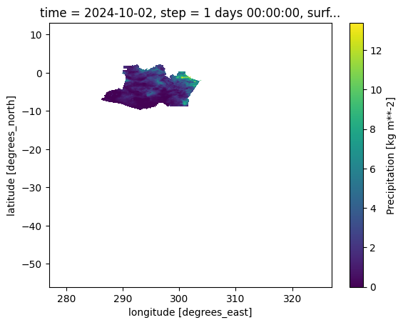
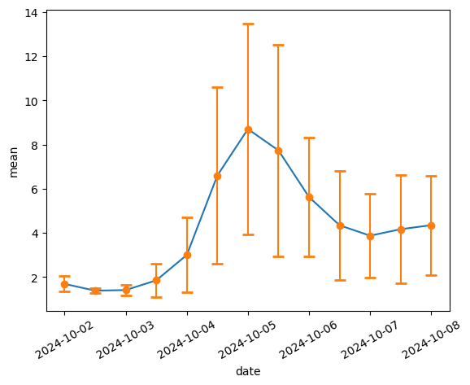

Como Usar o SMEC
=================

.. code:: ipython3

    !pip install matplotlib 

.. parsed-literal::

    Collecting matplotlib
      Using cached matplotlib-3.9.2-cp310-cp310-macosx_10_12_x86_64.whl.metadata (11 kB)
    Collecting contourpy>=1.0.1 (from matplotlib)
      Using cached contourpy-1.3.0-cp310-cp310-macosx_10_9_x86_64.whl.metadata (5.4 kB)
    Collecting cycler>=0.10 (from matplotlib)
      Using cached cycler-0.12.1-py3-none-any.whl.metadata (3.8 kB)
    Collecting fonttools>=4.22.0 (from matplotlib)
      Using cached fonttools-4.54.1-cp310-cp310-macosx_10_9_universal2.whl.metadata (163 kB)
    Collecting kiwisolver>=1.3.1 (from matplotlib)
      Using cached kiwisolver-1.4.7-cp310-cp310-macosx_10_9_x86_64.whl.metadata (6.3 kB)
    Requirement already satisfied: numpy>=1.23 in /Users/felipeomello/opt/anaconda3/envs/mask4/lib/python3.10/site-packages (from matplotlib) (2.1.2)
    Requirement already satisfied: packaging>=20.0 in /Users/felipeomello/opt/anaconda3/envs/mask4/lib/python3.10/site-packages (from matplotlib) (24.1)
    Collecting pillow>=8 (from matplotlib)
      Using cached pillow-10.4.0-cp310-cp310-macosx_10_10_x86_64.whl.metadata (9.2 kB)
    Collecting pyparsing>=2.3.1 (from matplotlib)
      Using cached pyparsing-3.1.4-py3-none-any.whl.metadata (5.1 kB)
    Requirement already satisfied: python-dateutil>=2.7 in /Users/felipeomello/opt/anaconda3/envs/mask4/lib/python3.10/site-packages (from matplotlib) (2.9.0)
    Requirement already satisfied: six>=1.5 in /Users/felipeomello/opt/anaconda3/envs/mask4/lib/python3.10/site-packages (from python-dateutil>=2.7->matplotlib) (1.16.0)
    Using cached matplotlib-3.9.2-cp310-cp310-macosx_10_12_x86_64.whl (7.9 MB)
    Using cached contourpy-1.3.0-cp310-cp310-macosx_10_9_x86_64.whl (265 kB)
    Using cached cycler-0.12.1-py3-none-any.whl (8.3 kB)
    Using cached fonttools-4.54.1-cp310-cp310-macosx_10_9_universal2.whl (2.8 MB)
    Using cached kiwisolver-1.4.7-cp310-cp310-macosx_10_9_x86_64.whl (65 kB)
    Using cached pillow-10.4.0-cp310-cp310-macosx_10_10_x86_64.whl (3.5 MB)
    Using cached pyparsing-3.1.4-py3-none-any.whl (104 kB)
    Installing collected packages: pyparsing, pillow, kiwisolver, fonttools, cycler, contourpy, matplotlib
    Successfully installed contourpy-1.3.0 cycler-0.12.1 fonttools-4.54.1 kiwisolver-1.4.7 matplotlib-3.9.2 pillow-10.4.0 pyparsing-3.1.4

.. code:: ipython3

    import products.CPTEC_SMEC as SMC
    smc = SMC.products()

.. parsed-literal::

    /Users/felipeomello/Censipam/ProjetoMarceloGuatura/Products-user/Products-user/src
    --------------------
    Products: {'prec', 'var3d', 'temp'}
    --------------------

.. code:: ipython3

    smc.help()

.. parsed-literal::

    Help on class products in module src.CPTEC_SMEC:
    
    class products(builtins.object)
     |  Methods defined here:
     |  
     |  __clean__()
     |      When the request process is interrupted, the tool will not remove the temporary files. 
     |      This function removes any temporary directory that has been on the disk for more than 2 days.
     |  
     |  __get_product__(self)
     |      Function to read the product from the server self.dict[‘server’][‘ftp’].
     |  
     |  __init__(self)
     |      Function to initialize the MERGE configurator, 
     |      returns an object with the load/load_range functions enabled for use
     |  
     |  help(self)
     |      Function to display product information and their operations.
     |  
     |  list_areas(self, tipo=None)
     |      Function to display and return the abbreviations used in the shapefile definitions to clip the area.
     |      
     |      Parameters
     |      ----------
     |      tipo      - Required  : Type to filter areas 
     |                              (e.g. 'paises', 'regioes',
     |                                 'estados', 'bacias', 'biomas') (Str)
     |      
     |      
     |      Returns
     |      -------
     |      json : Json
     |          The newly Json.
     |  
     |  load(self, product='prec', initiation='2024-10-01T00:00', forecast='2024-10-02T00:00')
     |      The load function loads the requested data from the CPTEC server into memory.
     |      
     |      During execution, a temporary directory is created to handle the files 
     |      and is deleted as soon as the request is completed."
     |      
     |          Parameters
     |          ----------
     |          product      - Optional  : 'climatology', 'hourly', 'hourly_now', 'daily' (Str)
     |          accumulated  - Optional  : 'monthly_average', 'monthly_accumulated_yearly',
     |                                 'year_accumulated', 'monthly_accumulated', 'daily_average', 
     |                                 'monthly_average_yearly'
     |      
     |                                 None for 'hourly', 'hourly_now', 'daily' (Str)
     |      
     |          year         - Optional  : year (Str)
     |          month        - Optional  : month (Str)
     |          day          - Optional  : day (Str)
     |          hour         - Optional  : hour (Str)
     |      
     |      ------------------------------------------------------------------------------------------------------------       
     |      
     |      load(product='daily', accumulated=None, year="2024", month="01", day="01", hour="00")
     |      
     |      ------------------------------------------------------------------------------------------------------------       
     |      
     |          Returns
     |          -------
     |          dataset : Dataset
     |              The newly created dataset.
     |  
     |  load_all(self, product='prec', initiation='2024-10-01T00:00', bar=True)
     |      The load_range function loads a range the requested data from the CPTEC server 
     |      into memory.
     |      
     |      During execution, a temporary directory is created to handle the files 
     |      and is deleted as soon as the request is completed."
     |      
     |      Parameters
     |      ----------
     |      product      - Optional  : 'climatology', 'hourly', 'hourly_now', 'daily' (Str)
     |      accumulated  - Optional  : 'monthly_average', 'monthly_accumulated_yearly',
     |                                 'year_accumulated', 'monthly_accumulated', 'daily_average', 
     |                                 'monthly_average_yearly'
     |      
     |                                 None for 'hourly', 'hourly_now', 'daily' (Str)
     |      
     |      start         - Optional  : start of interval. The interval includes this value. (datetime64[h])
     |      stop          - Optional  : end of interval. The interval does not include this value,(datetime64[h])
     |      step          - Optional  : spacing between values.  (Int)
     |      unit          - Optional  : time units (Str)
     |                                  'Y' - generates dates with a yearly frequency.
     |                                  'M' - generates dates with a monthly frequency.
     |                                  'D' - generates dates with a daily frequency.
     |                                  'h' - generates times with an hourly frequency.                                    'D' - generates dates with a daily frequency.
     |      
     |      bar           - Optional  : show progress bar (True/False) Default: True
     |      
     |      ------------------------------------------------------------------------------------------------------------       
     |      
     |      load_range(product='daily', accumulated=None, start='2023-01-01T00:00', 
     |                          stop='2023-02-01T00:00', step='1', unit='D', bar = True)
     |      
     |      ------------------------------------------------------------------------------------------------------------       
     |      
     |      Returns
     |      -------
     |      dataset : Dataset
     |          The newly created dataset.
     |  
     |  load_all_shape(self, product='prec', initiation='2024-10-01T00:00', bar=True, shp='estados_sp')
     |      The load_range function loads a range the requested data from the CPTEC server 
     |      into memory and cuts the defined shape.
     |      
     |      
     |      Parameters
     |      ----------
     |      product      - Optional  : 'climatology', 'hourly', 'hourly_now', 'daily' (Str)
     |      accumulated  - Optional  : 'monthly_average', 'monthly_accumulated_yearly',
     |                                 'year_accumulated', 'monthly_accumulated', 'daily_average', 
     |                                 'monthly_average_yearly'
     |      
     |                                 None for 'hourly', 'hourly_now', 'daily' (Str)
     |      
     |      start         - Optional  : start of interval. The interval includes this value. (datetime64[h])
     |      stop          - Optional  : end of interval. The interval does not include this value,(datetime64[h])
     |      step          - Optional  : spacing between values.  (Int)
     |      unit          - Optional  : time units (Str)
     |                                  'Y' - generates dates with a yearly frequency.
     |                                  'M' - generates dates with a monthly frequency.
     |                                  'D' - generates dates with a daily frequency.
     |                                  'h' - generates times with an hourly frequency.     
     |      
     |      
     |      
     |      bar           - Optional  : show progress bar (True/False) Default: True
     |      shp          - Optional  : shape (Str) -  see function list_areas()
     |      
     |      ------------------------------------------------------------------------------------------------------------       
     |      
     |      load_range(product='daily', accumulated=None, start='2023-01-01T00:00', 
     |                          stop='2023-02-01T00:00', step='1', unit='D', bar = True)
     |      
     |      ------------------------------------------------------------------------------------------------------------       
     |      
     |      Returns
     |      -------
     |      dataset : Dataset
     |          The newly created dataset.
     |  
     |  load_shape(self, product='prec', initiation='2024-10-01T00:00', forecast='2024-10-02T00:00', shp='estados_sp')
     |      The load_shape function loads the requested data from the CPTEC server 
     |      into memory and cuts the defined shape.
     |      
     |      
     |          Parameters
     |          ----------
     |          product      - Optional  : 'climatology', 'hourly', 'hourly_now', 'daily' (Str)
     |          accumulated  - Optional  : 'monthly_average', 'monthly_accumulated_yearly',
     |                                 'year_accumulated', 'monthly_accumulated', 'daily_average', 
     |                                 'monthly_average_yearly'
     |      
     |                                 None for 'hourly', 'hourly_now', 'daily' (Str)
     |      
     |          year         - Optional  : year (Str)
     |          month        - Optional  : month (Str)
     |          day          - Optional  : day (Str)
     |          hour         - Optional  : hour (Str)
     |          shp          - Optional  : shape (Str) -  see function list_areas()
     |      
     |      ------------------------------------------------------------------------------------------------------------       
     |      
     |      load(product='daily', accumulated=None, year="2024", month="01", day="01", hour="00")
     |      
     |      ------------------------------------------------------------------------------------------------------------       
     |      
     |          Returns
     |          -------
     |          dataset : Dataset
     |              The newly created dataset.
     |  
     |  makeMask(self, lon, lat, res, shapefile)
     |  
     |  stats(self, ds, var)
     |      Function to generate data statistics.
     |      
     |      
     |      Parameters
     |      ----------
     |      ds      - Required  : Data to calculate (Dataset)
     |      var     - Required  : Variable to filter (Str)
     |      
     |      Returns
     |      -------
     |      dataframe : Dataframe
     |          The newly created dataframe.
     |  
     |  ----------------------------------------------------------------------
     |  Data descriptors defined here:
     |  
     |  __dict__
     |      dictionary for instance variables (if defined)
     |  
     |  __weakref__
     |      list of weak references to the object (if defined)
    

.. code:: ipython3

    smc.list_products

.. parsed-literal::

    {'prec', 'temp', 'var3d'}

.. code:: ipython3

    f=smc.load(product='prec', initiation='2024-10-01T00:00',  forecast='2024-10-02T00:00')

.. code:: ipython3

    f

.. raw:: html

    
<svg style="position: absolute; width: 0; height: 0; overflow: hidden">
    <defs>
    <symbol id="icon-database" viewBox="0 0 32 32">
    <path d="M16 0c-8.837 0-16 2.239-16 5v4c0 2.761 7.163 5 16 5s16-2.239 16-5v-4c0-2.761-7.163-5-16-5z"></path>
    <path d="M16 17c-8.837 0-16-2.239-16-5v6c0 2.761 7.163 5 16 5s16-2.239 16-5v-6c0 2.761-7.163 5-16 5z"></path>
    <path d="M16 26c-8.837 0-16-2.239-16-5v6c0 2.761 7.163 5 16 5s16-2.239 16-5v-6c0 2.761-7.163 5-16 5z"></path>
    </symbol>
    <symbol id="icon-file-text2" viewBox="0 0 32 32">
    <path d="M28.681 7.159c-0.694-0.947-1.662-2.053-2.724-3.116s-2.169-2.030-3.116-2.724c-1.612-1.182-2.393-1.319-2.841-1.319h-15.5c-1.378 0-2.5 1.121-2.5 2.5v27c0 1.378 1.122 2.5 2.5 2.5h23c1.378 0 2.5-1.122 2.5-2.5v-19.5c0-0.448-0.137-1.23-1.319-2.841zM24.543 5.457c0.959 0.959 1.712 1.825 2.268 2.543h-4.811v-4.811c0.718 0.556 1.584 1.309 2.543 2.268zM28 29.5c0 0.271-0.229 0.5-0.5 0.5h-23c-0.271 0-0.5-0.229-0.5-0.5v-27c0-0.271 0.229-0.5 0.5-0.5 0 0 15.499-0 15.5 0v7c0 0.552 0.448 1 1 1h7v19.5z"></path>
    <path d="M23 26h-14c-0.552 0-1-0.448-1-1s0.448-1 1-1h14c0.552 0 1 0.448 1 1s-0.448 1-1 1z"></path>
    <path d="M23 22h-14c-0.552 0-1-0.448-1-1s0.448-1 1-1h14c0.552 0 1 0.448 1 1s-0.448 1-1 1z"></path>
    <path d="M23 18h-14c-0.552 0-1-0.448-1-1s0.448-1 1-1h14c0.552 0 1 0.448 1 1s-0.448 1-1 1z"></path>
    </symbol>
    </defs>
    </svg>
    <pre class='xr-text-repr-fallback'>&lt;xarray.Dataset&gt; Size: 1MB
    Dimensions:     (lat: 691, lon: 501)
    Coordinates:
        time        datetime64[ns] 8B ...
        step        timedelta64[ns] 8B ...
        surface     float64 8B ...
      * lat         (lat) float64 6kB -56.0 -55.9 -55.8 -55.7 ... 12.8 12.9 13.0
      * lon         (lon) float64 4kB 277.0 277.1 277.2 277.3 ... 326.8 326.9 327.0
        valid_time  datetime64[ns] 8B 2024-10-02
    Data variables:
        prec        (lat, lon) float32 1MB ...
    Attributes:
        GRIB_edition:            2
        GRIB_centre:             consensus
        GRIB_centreDescription:  Consensus
        GRIB_subCentre:          0
        Conventions:             CF-1.7
        institution:             Consensus
        history:                 2024-10-30T09:54 GRIB to CDM+CF via cfgrib-0.9.1...</pre>

xarray.Dataset

<ul class='xr-sections'><li class='xr-section-item'><input id='section-f307a58d-6427-42de-806f-abdbd5ad34e2' class='xr-section-summary-in' type='checkbox' disabled ><label for='section-f307a58d-6427-42de-806f-abdbd5ad34e2' class='xr-section-summary'  title='Expand/collapse section'>Dimensions:</label>
<ul class='xr-dim-list'><li>lat: 691</li><li>lon: 501</li></ul>

</li><li class='xr-section-item'><input id='section-290213c7-7b7f-465f-b7ac-f6b2c0fe6ed1' class='xr-section-summary-in' type='checkbox'  checked><label for='section-290213c7-7b7f-465f-b7ac-f6b2c0fe6ed1' class='xr-section-summary' >Coordinates: (6)</label>

<ul class='xr-var-list'><li class='xr-var-item'>
time

()

datetime64[ns]

...
<input id='attrs-a8432265-4016-40c7-9769-3999136e858e' class='xr-var-attrs-in' type='checkbox' ><label for='attrs-a8432265-4016-40c7-9769-3999136e858e' title='Show/Hide attributes'><svg class='icon xr-icon-file-text2'><use xlink:href='#icon-file-text2'></use></svg></label><input id='data-d7661d63-4be5-419c-bc35-a0134f776a13' class='xr-var-data-in' type='checkbox'><label for='data-d7661d63-4be5-419c-bc35-a0134f776a13' title='Show/Hide data repr'><svg class='icon xr-icon-database'><use xlink:href='#icon-database'></use></svg></label>
<dl class='xr-attrs'><dt>long_name :</dt><dd>initial time of forecast</dd><dt>standard_name :</dt><dd>forecast_reference_time</dd></dl>

<pre>np.datetime64(&#x27;2024-10-02T00:00:00.000000000&#x27;)</pre>
</li><li class='xr-var-item'>
step

()

timedelta64[ns]

...
<input id='attrs-3977ea42-43a4-4fa3-a25d-7045e9867132' class='xr-var-attrs-in' type='checkbox' ><label for='attrs-3977ea42-43a4-4fa3-a25d-7045e9867132' title='Show/Hide attributes'><svg class='icon xr-icon-file-text2'><use xlink:href='#icon-file-text2'></use></svg></label><input id='data-f700f1fa-9ba8-4672-87c6-4440113a626c' class='xr-var-data-in' type='checkbox'><label for='data-f700f1fa-9ba8-4672-87c6-4440113a626c' title='Show/Hide data repr'><svg class='icon xr-icon-database'><use xlink:href='#icon-database'></use></svg></label>
<dl class='xr-attrs'><dt>long_name :</dt><dd>time since forecast_reference_time</dd><dt>standard_name :</dt><dd>forecast_period</dd></dl>

<pre>[1 values with dtype=timedelta64[ns]]</pre>
</li><li class='xr-var-item'>
surface

()

float64

...
<input id='attrs-c7ad5c40-af06-4703-8e5c-c143f92c7c4e' class='xr-var-attrs-in' type='checkbox' ><label for='attrs-c7ad5c40-af06-4703-8e5c-c143f92c7c4e' title='Show/Hide attributes'><svg class='icon xr-icon-file-text2'><use xlink:href='#icon-file-text2'></use></svg></label><input id='data-620e9ed1-42ba-4ddb-b174-a537fb9e658e' class='xr-var-data-in' type='checkbox'><label for='data-620e9ed1-42ba-4ddb-b174-a537fb9e658e' title='Show/Hide data repr'><svg class='icon xr-icon-database'><use xlink:href='#icon-database'></use></svg></label>
<dl class='xr-attrs'><dt>long_name :</dt><dd>original GRIB coordinate for key: level(surface)</dd><dt>units :</dt><dd>1</dd></dl>

<pre>[1 values with dtype=float64]</pre>
</li><li class='xr-var-item'>
lat

(lat)

float64

-56.0 -55.9 -55.8 ... 12.9 13.0
<input id='attrs-d578926a-bd85-4612-a0bd-8c56287b25dd' class='xr-var-attrs-in' type='checkbox' ><label for='attrs-d578926a-bd85-4612-a0bd-8c56287b25dd' title='Show/Hide attributes'><svg class='icon xr-icon-file-text2'><use xlink:href='#icon-file-text2'></use></svg></label><input id='data-7c25a185-32cd-41c6-ab48-023c3933bee5' class='xr-var-data-in' type='checkbox'><label for='data-7c25a185-32cd-41c6-ab48-023c3933bee5' title='Show/Hide data repr'><svg class='icon xr-icon-database'><use xlink:href='#icon-database'></use></svg></label>
<dl class='xr-attrs'><dt>units :</dt><dd>degrees_north</dd><dt>standard_name :</dt><dd>latitude</dd><dt>long_name :</dt><dd>latitude</dd></dl>

<pre>array([-56. , -55.9, -55.8, ...,  12.8,  12.9,  13. ])</pre>
</li><li class='xr-var-item'>
lon

(lon)

float64

277.0 277.1 277.2 ... 326.9 327.0
<input id='attrs-1ea5d05b-b799-4e31-9189-7709aafef708' class='xr-var-attrs-in' type='checkbox' ><label for='attrs-1ea5d05b-b799-4e31-9189-7709aafef708' title='Show/Hide attributes'><svg class='icon xr-icon-file-text2'><use xlink:href='#icon-file-text2'></use></svg></label><input id='data-573e73a1-07c8-42f5-8890-17783d30d485' class='xr-var-data-in' type='checkbox'><label for='data-573e73a1-07c8-42f5-8890-17783d30d485' title='Show/Hide data repr'><svg class='icon xr-icon-database'><use xlink:href='#icon-database'></use></svg></label>
<dl class='xr-attrs'><dt>units :</dt><dd>degrees_east</dd><dt>standard_name :</dt><dd>longitude</dd><dt>long_name :</dt><dd>longitude</dd></dl>

<pre>array([277. , 277.1, 277.2, ..., 326.8, 326.9, 327. ])</pre>
</li><li class='xr-var-item'>
valid_time

()

datetime64[ns]

2024-10-02
<input id='attrs-b086c785-651d-4c5d-b607-a07115f57c1e' class='xr-var-attrs-in' type='checkbox' ><label for='attrs-b086c785-651d-4c5d-b607-a07115f57c1e' title='Show/Hide attributes'><svg class='icon xr-icon-file-text2'><use xlink:href='#icon-file-text2'></use></svg></label><input id='data-44c63943-e969-4cce-b67b-488a394261f6' class='xr-var-data-in' type='checkbox'><label for='data-44c63943-e969-4cce-b67b-488a394261f6' title='Show/Hide data repr'><svg class='icon xr-icon-database'><use xlink:href='#icon-database'></use></svg></label>
<dl class='xr-attrs'><dt>standard_name :</dt><dd>time</dd><dt>long_name :</dt><dd>time</dd></dl>

<pre>array(&#x27;2024-10-02T00:00:00.000000000&#x27;, dtype=&#x27;datetime64[ns]&#x27;)</pre>
</li></ul>
</li><li class='xr-section-item'><input id='section-544c6973-1b10-40a1-b9ab-7fdf7ba5feda' class='xr-section-summary-in' type='checkbox'  checked><label for='section-544c6973-1b10-40a1-b9ab-7fdf7ba5feda' class='xr-section-summary' >Data variables: (1)</label>

<ul class='xr-var-list'><li class='xr-var-item'>
prec

(lat, lon)

float32

...
<input id='attrs-b711ccea-8f66-4281-be3c-b8f169e54a64' class='xr-var-attrs-in' type='checkbox' ><label for='attrs-b711ccea-8f66-4281-be3c-b8f169e54a64' title='Show/Hide attributes'><svg class='icon xr-icon-file-text2'><use xlink:href='#icon-file-text2'></use></svg></label><input id='data-7929764c-a491-4f75-9f35-693e1cb79c43' class='xr-var-data-in' type='checkbox'><label for='data-7929764c-a491-4f75-9f35-693e1cb79c43' title='Show/Hide data repr'><svg class='icon xr-icon-database'><use xlink:href='#icon-database'></use></svg></label>
<dl class='xr-attrs'><dt>GRIB_paramId :</dt><dd>260138</dd><dt>GRIB_dataType :</dt><dd>fc</dd><dt>GRIB_numberOfPoints :</dt><dd>346191</dd><dt>GRIB_typeOfLevel :</dt><dd>surface</dd><dt>GRIB_stepUnits :</dt><dd>1</dd><dt>GRIB_stepType :</dt><dd>instant</dd><dt>GRIB_gridType :</dt><dd>regular_ll</dd><dt>GRIB_uvRelativeToGrid :</dt><dd>0</dd><dt>GRIB_NV :</dt><dd>0</dd><dt>GRIB_Nx :</dt><dd>501</dd><dt>GRIB_Ny :</dt><dd>691</dd><dt>GRIB_cfName :</dt><dd>unknown</dd><dt>GRIB_cfVarName :</dt><dd>prec</dd><dt>GRIB_gridDefinitionDescription :</dt><dd>Latitude/longitude. Also called equidistant cylindrical, or Plate Carree</dd><dt>GRIB_iDirectionIncrementInDegrees :</dt><dd>0.1</dd><dt>GRIB_iScansNegatively :</dt><dd>0</dd><dt>GRIB_jDirectionIncrementInDegrees :</dt><dd>0.1</dd><dt>GRIB_jPointsAreConsecutive :</dt><dd>0</dd><dt>GRIB_jScansPositively :</dt><dd>1</dd><dt>GRIB_latitudeOfFirstGridPointInDegrees :</dt><dd>-56.0</dd><dt>GRIB_latitudeOfLastGridPointInDegrees :</dt><dd>13.0</dd><dt>GRIB_longitudeOfFirstGridPointInDegrees :</dt><dd>277.0</dd><dt>GRIB_longitudeOfLastGridPointInDegrees :</dt><dd>327.0</dd><dt>GRIB_missingValue :</dt><dd>3.4028234663852886e+38</dd><dt>GRIB_name :</dt><dd>Precipitation</dd><dt>GRIB_shortName :</dt><dd>prec</dd><dt>GRIB_units :</dt><dd>kg m**-2</dd><dt>long_name :</dt><dd>Precipitation</dd><dt>units :</dt><dd>kg m**-2</dd><dt>standard_name :</dt><dd>unknown</dd></dl>

<pre>[346191 values with dtype=float32]</pre>
</li></ul>
</li><li class='xr-section-item'><input id='section-6f91a800-db40-4f6e-8577-71635dcf0107' class='xr-section-summary-in' type='checkbox'  ><label for='section-6f91a800-db40-4f6e-8577-71635dcf0107' class='xr-section-summary' >Indexes: (2)</label>

<ul class='xr-var-list'><li class='xr-var-item'>

lat

PandasIndex

<input id='index-3a2f71ac-7f71-470b-a724-1dec98d2820d' class='xr-index-data-in' type='checkbox'/><label for='index-3a2f71ac-7f71-470b-a724-1dec98d2820d' title='Show/Hide index repr'><svg class='icon xr-icon-database'><use xlink:href='#icon-database'></use></svg></label>
<pre>PandasIndex(Index([              -56.0,               -55.9,               -55.8,
           -55.699999999999996, -55.599999999999994,  -55.49999999999999,
            -55.39999999999999,  -55.29999999999999,  -55.19999999999999,
            -55.09999999999999,
           ...
              12.1000000000005,    12.2000000000005,    12.3000000000005,
              12.4000000000005,    12.5000000000005,  12.600000000000499,
            12.700000000000498,  12.800000000000498,  12.900000000000498,
                          13.0],
          dtype=&#x27;float64&#x27;, name=&#x27;lat&#x27;, length=691))</pre>
</li><li class='xr-var-item'>

lon

PandasIndex

<input id='index-25e1f8ee-5a20-46e1-9d11-58f489552f44' class='xr-index-data-in' type='checkbox'/><label for='index-25e1f8ee-5a20-46e1-9d11-58f489552f44' title='Show/Hide index repr'><svg class='icon xr-icon-database'><use xlink:href='#icon-database'></use></svg></label>
<pre>PandasIndex(Index([             277.0,              277.1, 277.20000000000005,
           277.30000000000007,  277.4000000000001,  277.5000000000001,
           277.60000000000014, 277.70000000000016,  277.8000000000002,
            277.9000000000002,
           ...
           326.10000000001116,  326.2000000000112,  326.3000000000112,
           326.40000000001123, 326.50000000001125,  326.6000000000113,
            326.7000000000113,  326.8000000000113, 326.90000000001135,
                        327.0],
          dtype=&#x27;float64&#x27;, name=&#x27;lon&#x27;, length=501))</pre>
</li></ul>
</li><li class='xr-section-item'><input id='section-4864d30f-7b40-4ed1-8c42-27707707fa6b' class='xr-section-summary-in' type='checkbox'  checked><label for='section-4864d30f-7b40-4ed1-8c42-27707707fa6b' class='xr-section-summary' >Attributes: (7)</label>

<dl class='xr-attrs'><dt>GRIB_edition :</dt><dd>2</dd><dt>GRIB_centre :</dt><dd>consensus</dd><dt>GRIB_centreDescription :</dt><dd>Consensus</dd><dt>GRIB_subCentre :</dt><dd>0</dd><dt>Conventions :</dt><dd>CF-1.7</dd><dt>institution :</dt><dd>Consensus</dd><dt>history :</dt><dd>2024-10-30T09:54 GRIB to CDM+CF via cfgrib-0.9.14.1/ecCodes-2.38.0 with {&quot;source&quot;: &quot;.temporary_files/SMEC/SMEC_PREC_2024100100_2024100200.grib2&quot;, &quot;filter_by_keys&quot;: {}, &quot;encode_cf&quot;: [&quot;parameter&quot;, &quot;time&quot;, &quot;geography&quot;, &quot;vertical&quot;]}</dd></dl>
</li></ul>

.. code:: ipython3

    f2 = smc.load_all(product='prec', initiation='2024-10-01T00:00')

.. parsed-literal::

    2024-10-08T00:00:00.000000 |██████████████████████████████████████████████████| 100.0% Complete

.. code:: ipython3

    f2.time.values

.. parsed-literal::

    array(['2024-10-02T00:00:00.000000000', '2024-10-02T12:00:00.000000000',
           '2024-10-03T00:00:00.000000000', '2024-10-03T12:00:00.000000000',
           '2024-10-04T00:00:00.000000000', '2024-10-04T12:00:00.000000000',
           '2024-10-05T00:00:00.000000000', '2024-10-05T12:00:00.000000000',
           '2024-10-06T00:00:00.000000000', '2024-10-06T12:00:00.000000000',
           '2024-10-07T00:00:00.000000000', '2024-10-07T12:00:00.000000000',
           '2024-10-08T00:00:00.000000000'], dtype='datetime64[ns]')

.. code:: ipython3

    # tipo = (paises/regioes/estados/bacias/biomas)
    p=smc.list_areas(tipo='estados')

.. parsed-literal::

    Usage: type_abbreviation e.g. shp='estados_sp'
    Area    -   type_abbreviation
    Acre - estados_ac
    Alagoas - estados_al
    Amazônia - estados_am
    Amapá - estados_ap
    Bahia - estados_ba
    Ceará - estados_ce
    Distrito Federal - estados_df
    Espírito Santo - estados_es
    Goiás - estados_go
    Maranhão - estados_ma
    Minas Gerais - estados_mg
    Mato Grosso do Sul - estados_ms
    Mato Grosso - estados_mt
    Pará - estados_pa
    Paraíba - estados_pb
    Pernambuco - estados_pe
    Piauí - estados_pi
    Paraná - estados_pr
    Rio de Janeiro - estados_rj
    Rio Grande do Norte - estados_rn
    Rondônia - estados_ro
    Roraima - estados_rr
    Rio Grande do Sul - estados_rs
    Santa Catarina - estados_sc
    Sergipe - estados_se
    São Paulo - estados_sp
    Tocantins - estados_to

.. code:: ipython3

    p

.. parsed-literal::

    {'AC': ['1', 'Acre'],
     'AL': ['2', 'Alagoas'],
     'AM': ['3', 'Amazônia'],
     'AP': ['4', 'Amapá'],
     'BA': ['5', 'Bahia'],
     'CE': ['6', 'Ceará'],
     'DF': ['7', 'Distrito Federal'],
     'ES': ['8', 'Espírito Santo'],
     'GO': ['9', 'Goiás'],
     'MA': ['10', 'Maranhão'],
     'MG': ['11', 'Minas Gerais'],
     'MS': ['12', 'Mato Grosso do Sul'],
     'MT': ['13', 'Mato Grosso'],
     'PA': ['14', 'Pará'],
     'PB': ['15', 'Paraíba'],
     'PE': ['16', 'Pernambuco'],
     'PI': ['17', 'Piauí'],
     'PR': ['18', 'Paraná'],
     'RJ': ['19', 'Rio de Janeiro'],
     'RN': ['20', 'Rio Grande do Norte'],
     'RO': ['21', 'Rondônia'],
     'RR': ['22', 'Roraima'],
     'RS': ['23', 'Rio Grande do Sul'],
     'SC': ['24', 'Santa Catarina'],
     'SE': ['25', 'Sergipe'],
     'SP': ['26', 'São Paulo'],
     'TO': ['27', 'Tocantins']}

.. code:: ipython3

    f3 = smc.load_shape(shp="estados_am")

.. code:: ipython3

    f3.prec.plot()

.. parsed-literal::

    <matplotlib.collections.QuadMesh at 0x142455a20>

.. code:: ipython3

    f4 = smc.load_all_shape(shp="estados_am")

.. parsed-literal::

    2024-10-08T00:00:00.000000 |██████████████████████████████████████████████████| 100.0% Complete

.. code:: ipython3

    df = smc.stats(f4,'prec')

.. code:: ipython3

    df

.. raw:: html

    

    
    <table border="1" class="dataframe">
      <thead>
        <tr style="text-align: right;">
          <th></th>
          <th>date</th>
          <th>count</th>
          <th>mean</th>
          <th>std</th>
          <th>min</th>
          <th>25%</th>
          <th>50%</th>
          <th>75%</th>
          <th>max</th>
        </tr>
      </thead>
      <tbody>
        <tr>
          <th>0</th>
          <td>2024-10-02 00:00:00</td>
          <td>12798.0</td>
          <td>1.693709</td>
          <td>1.891567</td>
          <td>0.000000</td>
          <td>0.343750</td>
          <td>1.093750</td>
          <td>2.281250</td>
          <td>13.375000</td>
        </tr>
        <tr>
          <th>1</th>
          <td>2024-10-02 12:00:00</td>
          <td>12798.0</td>
          <td>1.386740</td>
          <td>1.769010</td>
          <td>0.000000</td>
          <td>0.125000</td>
          <td>0.656250</td>
          <td>2.062500</td>
          <td>14.062500</td>
        </tr>
        <tr>
          <th>2</th>
          <td>2024-10-03 00:00:00</td>
          <td>12798.0</td>
          <td>1.414093</td>
          <td>1.631485</td>
          <td>0.000000</td>
          <td>0.250000</td>
          <td>0.843750</td>
          <td>1.937500</td>
          <td>12.406250</td>
        </tr>
        <tr>
          <th>3</th>
          <td>2024-10-03 12:00:00</td>
          <td>12798.0</td>
          <td>1.853159</td>
          <td>1.433024</td>
          <td>0.015625</td>
          <td>0.750000</td>
          <td>1.507812</td>
          <td>2.609375</td>
          <td>11.781250</td>
        </tr>
        <tr>
          <th>4</th>
          <td>2024-10-04 00:00:00</td>
          <td>12798.0</td>
          <td>3.005617</td>
          <td>1.893326</td>
          <td>0.125000</td>
          <td>1.703125</td>
          <td>2.578125</td>
          <td>3.906250</td>
          <td>23.046875</td>
        </tr>
        <tr>
          <th>5</th>
          <td>2024-10-04 12:00:00</td>
          <td>12798.0</td>
          <td>6.603454</td>
          <td>3.648154</td>
          <td>0.187500</td>
          <td>4.000000</td>
          <td>6.031250</td>
          <td>8.687500</td>
          <td>32.500000</td>
        </tr>
        <tr>
          <th>6</th>
          <td>2024-10-05 00:00:00</td>
          <td>12798.0</td>
          <td>8.704954</td>
          <td>5.343550</td>
          <td>0.156250</td>
          <td>4.781250</td>
          <td>7.843750</td>
          <td>11.718750</td>
          <td>39.468750</td>
        </tr>
        <tr>
          <th>7</th>
          <td>2024-10-05 12:00:00</td>
          <td>12798.0</td>
          <td>7.735943</td>
          <td>4.147716</td>
          <td>0.093750</td>
          <td>4.781250</td>
          <td>6.968750</td>
          <td>10.000000</td>
          <td>32.812500</td>
        </tr>
        <tr>
          <th>8</th>
          <td>2024-10-06 00:00:00</td>
          <td>12798.0</td>
          <td>5.625259</td>
          <td>4.075664</td>
          <td>0.062500</td>
          <td>2.687500</td>
          <td>4.562500</td>
          <td>7.562500</td>
          <td>44.968750</td>
        </tr>
        <tr>
          <th>9</th>
          <td>2024-10-06 12:00:00</td>
          <td>12798.0</td>
          <td>4.346963</td>
          <td>2.708828</td>
          <td>0.250000</td>
          <td>2.468750</td>
          <td>3.750000</td>
          <td>5.500000</td>
          <td>21.093750</td>
        </tr>
        <tr>
          <th>10</th>
          <td>2024-10-07 00:00:00</td>
          <td>12798.0</td>
          <td>3.876372</td>
          <td>2.676594</td>
          <td>0.093750</td>
          <td>1.906250</td>
          <td>3.468750</td>
          <td>5.187500</td>
          <td>25.312500</td>
        </tr>
        <tr>
          <th>11</th>
          <td>2024-10-07 12:00:00</td>
          <td>12798.0</td>
          <td>4.170038</td>
          <td>2.437627</td>
          <td>0.203125</td>
          <td>2.453125</td>
          <td>3.796875</td>
          <td>5.375000</td>
          <td>20.578125</td>
        </tr>
        <tr>
          <th>12</th>
          <td>2024-10-08 00:00:00</td>
          <td>12798.0</td>
          <td>4.352619</td>
          <td>2.956051</td>
          <td>0.125000</td>
          <td>2.250000</td>
          <td>3.593750</td>
          <td>5.625000</td>
          <td>22.593750</td>
        </tr>
      </tbody>
    </table>
    

.. code:: ipython3

    import matplotlib.pyplot as plt
    import seaborn as sns

.. code:: ipython3

    plt.xticks(rotation=30)
    sns.lineplot(data=df, x="date", y="mean")
    plt.errorbar(df['date'] ,df['mean'], yerr=df['25%'], fmt='o', capsize=5, capthick=2)

.. code:: ipython3

    f4.to_netcdf("output.nc")

.. code:: ipython3

    !open "output.nc"

